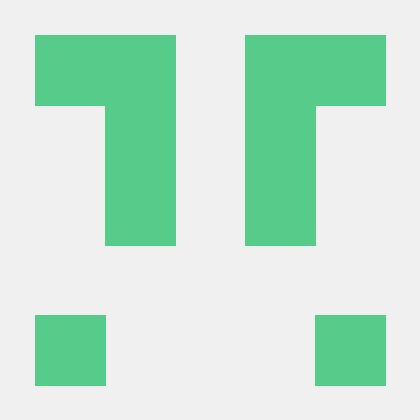

# About

## License

Published under AGPL-3. See the [full license](license.md) text.

## Contributors

| Contributor | GitHub Handle | |
| ----------- | ------------- |-|
| Jan Burdziej | [janbur](https://github.com/janbur) |  |
| Irwan Fathurrahman | [meomancer](https://github.com/meomancer) |   |
| Tim Sutton | [timlinux](https://github.com/timlinux) |  |
| Dimas Ciptura | [dimasciput](https://github.com/dimasciput) |  |
| Ben Norrito | [BenNorrito](https://github.com/BenNorrito) |  |
| Amy Burness | [amyburness](https://github.com/amyburness) |  |
| Lorenzo Libertini | [llibertini](https://github.com/llibertini) |  |
| Zulfikar Akbar Muzakki | [zamuzakki](https://github.com/zamuzakki) |  |
| Tharanath | [tharanathkartoza](https://github.com/tharanathkartoza) |  |

## Project Funders/Backers
This project was conceptualized and initially funded by Unicef.

## Logos

Another fine project contributed to by: [Kartoza.com](https://kartoza.com)

