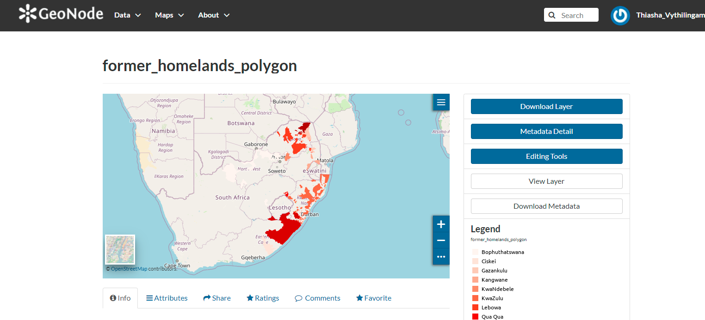
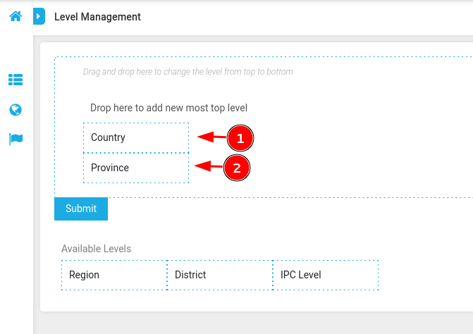
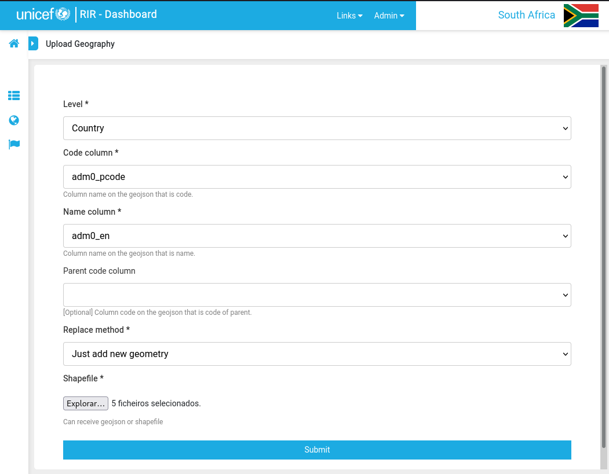

[//]: # "GeoSight is UNICEF's geospatial web-based business intelligence platform."
[//]: # 
[//]: # "Contact : geosight-no-reply@unicef.org"
[//]: # 
[//]: # ".. note:: This program is free software; you can redistribute it and/or modify"
[//]: # "    it under the terms of the GNU Affero General Public License as published by"
[//]: # "    the Free Software Foundation; either version 3 of the License, or"
[//]: # "    (at your option) any later version."
[//]: # 
[//]: # "__author__ = 'irwan@kartoza.com'"
[//]: # "__date__ = '13/06/2023'"
[//]: # "__copyright__ = ('Copyright 2023, Unicef')"
[//]: # "__copyright__ = ('Copyright 2023, Unicef')"

# Administrator Tutorial

## Introduction

🧑‍🏫 The RIR (Risk Informed Response) platform is a situational awareness platform to monitor health, child protection, nutrition, wash, and education in a geographic region. This tutorial shows you how to manage the platform as an administrator.

### Working with this documentation

Whenever you see a phrase in **bold**, it refers to a link or button on the user interface that you can interact with.

### Important Links

* [RIR Platform](https://staging.rir.kartoza.com/ "RIR Platform")
* [RIR Full Documentation](https://kartoza.github.io/rir-dashboard/ "RIR Full Documentation")  

> 📒 **Note:** You can find all the **sample data** used in this tutorial [here](data/RIRTrainingData.zip "Data")

## Session Outline

🧑‍🏫 This session is divided into two parts:

1. **Part 1:** General Platform Administration covering
     * User Management: Creating and editing user profiles.
     * Managing Instances: Creating new and editing preexisting instances.
     * Managing Context Layers: Adding layers from services such as ArcGIS online, GeoNode or GeoServer to create a context layer in the platform.
     * Geography management: Adding geography levels to your instance.

2. **Part 2:** Indicator Administration covering
     * Indicator management: Adding indicators to the dashboard.
     * Forms: used to manually capture indicator data by filling in forms.
     * Ingestors: Used to manually import data by uploading spreadsheets.
     * Harvesters: Automatic agents which fetch data and add it to indicators on a regular basis.

## Part 1: General Platform Administration

Here is an overview of the general platform administration.

 

> 📒 **Note**: The following sections all require admin user permissions.

There are two key activity areas for administering the RIR platform.

1. Django admin
2. RIR Platform admin

Django admin is used for more technical activities and provides a more generic user interface. The RIR Platform admin area is integrated into the frontend of the site and can be used to manage instances, geographies and indicators.

### **Signing In**

🧑‍🏫 Before you can administer the platform, you need to sign in with a user with administrator rights. In the top right-hand corner of the screen is the **Sign In** button. Here, you will sign in using your admin username and password. This process is the same for a regular user and an admin user.  


### **Users and Permissions**

> 💡 This activity will use the django admin interface.

Next, we will look at how to manage users. Go to site administration by clicking **Admin -> Django Admin**. Click on **+Add** in the same row as ‘Users’.


You can now create a profile for someone by adding a username and password. Once you have created the user profile, click **Save**.


> 📝 **Note:** In future the platform will be upgraded to support single sign-on with your Microsoft Teams credentials or similar oauth provider.

Once you have created the user account, pressing save will let you edit the personal information for the new user, as well as select or deselect their permission status. Remember to **Save** your changes.


> 📒 **Note**: If you want to make a user an admin user so that they can carry out the activities described in this tutorial, you should assign them to the **Staff** group, the **Super User** group and the **Active** box should be checked.


### **Creating an instance**

> 💡 This activity will use the RIR admin interface.

🧑‍🏫 Make sure you are signed in as an admin user. Open any existing instance, then click on the instance manager icon on the left of the screen.


To create a new instance, click on the Create Instance button at the top right of the screen.


On the instance form. add the name of the new instance that you would like to create, a description, as well as the icon file. The icon file in most cases would be the flag of the country for the instance. Once you have added all of the information, click **Save**.

For this tutorial, we will create a demonstrator instance for South Africa:


The flag we used in this exercise is available here:


> **Note:** You can find all the **sample data** used in this tutorial (including this flag image) [here](data/RIRTrainingData.zip).

Once your new instance is created, you will be able to open it from the instance chooser. It will appear very empty, like this:

 

### **Adding a new Context layer**

> 💡 This activity will use the django admin interface.

🧑‍🏫 In this section we will explain how to create and manage context layers. What is a context layer? Context layers are shown on the map to provide a sense of the conditions in the region. They can cover any topic - for example, security, food security, infrastructure, etc. Context layers **do not** have indicator data attached, they are a visual aid in the dashboard map. Context layers are normally hosted on another server e.g. ArcGIS Online, GeoServer, and GeoNode all provide ways to publish context layers.

> **Note:** For more information about context layers see the [user tutorial](../user_tutorial/#context-layers) on this topic.

To add a context layer to the RIR instance, you will need a link to an online layer. For this exercise will be adding a context layer from geonode showing [homelands](https://staging.osgs.rir.kartoza.com/layers/geonode_data:geonode:former_homelands_polygon):



> 👨‍🏫 The process for finding the link to an online layer so it can be used as a context layer differs per platform the layer is hosted on. For Geonode layers we need to open the layer in Geonode, right-click on the browser page, click on inspect, and then select network. Hard refresh your screen and look through the URL links until you see the layer URL.

For our example, we will use the URL below. Please copy it:


```
https://staging.osgs.rir.kartoza.com/geoserver/ows?access_token=SWMqWx64T5dOsNwPD72o4uIbtZ7FIA&LAYERS=geonode%3Aformer_homelands_polygon&TRANSPARENT=TRUE&SERVICE=WMS&VERSION=1.1.1&REQUEST=GetMap&STYLES=&FORMAT=image%2Fpng&SRS=EPSG%3A900913&BBOX=2504688.5425,-3757032.81375,3757032.81375,-2504688.5425&WIDTH=256&HEIGHT=256
```

👨‍🏫 Now we can create the context layer in the RIR platform. Click on your account menu in the top right corner of the RIR platform and open **Django Admin**. Click on **+Add** on the Context Layers line. Select the instance you would like to add the context layer to.


We will use the instance that we have just created, South Africa. Paste the URL that you copied above into the URL box.

Enter the information in the form as shown in the images below and save the form once you are happy with it.


Click on **View Site** to see your new layer. You will be able to see your new layer in the **Context Layers** panel.


### Geography Management

#### Adding a Geography level

> 💡 This activity will use the django admin interface.

🧑‍🏫 Geography levels express the hierarchy between administrative boundaries. For example in South Africa we have the national boundary subdivided into provinces, which are in turn subdivided into districts, then municipalities. RIR uses these geography levels to provide a way to group the information from the indicators into administrative units.

> ⚠ Geography levels are shared globally across all RIR instances, so be careful when adding, deleting or renaming a level that you do not impact other users.

👨‍🏫 Let’s start in  **Site Administration**. Scroll down to **Geometry Level Instances** and click **+Add**. Set the name and description to your geography level  - in our case we will use 'Province' (do not re-add the Province level instance if it already exists). Geometry levels are heirarchical and follow the political organisation of countries. For example 'Country', 'Province', 'District' etc.

#### Establishing the hierarchy

> 💡 This activity will use the RIR admin interface.

Geography levels are heirarchical and follow the political organisation of countries. For example 'Country', 'Province', 'District' etc. We need to explicitly tell the system which levels are the parent and child of each other.

To do this we use the Geography Level Management tool. Click on the **Geography Management** button on the left of the screen. Then click on the Geography Level Management button.


Now drag and drop the levels you want to establish the hierarchy between.



Having done this, the system will 'know' that provinces fall under the country boundary.

Press the **Submit** button to save the changes.

#### Uploading Geography Boundaries

> 💡 This activity will use the RIR admin interface.

 Go back to the main page of your instance. Below the **Program Interventions** panel are three icons; **Indicator Management**, **Geography Management**, and **Instance Management**.

Click on the **Geography Management** icon.


You will be redirected to the geography view map page, and you will see that in the top right corner there is an **+uploader** button.


Select this button and start filling in the form. We will create two new geographies: Country and Provices using the tutorial data supplied below:

> 📒 **Note:** You can find all the sample data used in this tutorial here: [Data](data/RIRTrainingData.zip "Data")

The geography boundary should be provided in either Esri Shapefile format or as a geojson file.

Add the country layer first. Start by clicking the **files** button at the bottom of the form and then select **all* of the shapefile layers.


Now complete the rest of the details as per the screenshot below. Note that the country geography does not need a parent, but we need the code for a country level. In this case, the country is ZA (under 'adm0_pcode').



For a province level, the code column is 'pr_code', the name column is 'pr_name', and the parent code column is 'c_pcode'.


## Part 2: Managing Indicators

Here is an overview of what we will cover in this section:


### **Adding a New Indicator**

🧑‍🏫 Indicators are special layers in RIR that are linked to the situation in the region. Indicators are used to show the situation in the region. For example, in South Africa, there are indicators for the number of people living in poverty, the number of people living in extreme poverty, the number of people living in extreme poverty, and the number of people living in extreme poverty and the number of people living in extreme poverty and the number of people living in extreme poverty.

👨‍🏫 To add an indicator, click on **Indicator Management** on the main platform page for the instance and go to **Create New**. Fill in the necessary information about the indicator you would like to create.

👨‍🏫 Once you have filled out the form, scroll down to **Scenario Rules** and add the parameters to match the indicator. you can also change the color for each rule by clicking on the color block. Click **Submit** once you are happy with the added information and scenario rules. If you add a dashboard link, you will see a black dot in the center of the circle that represents the scenario case on that indicator in the Program Interventions panel. By clicking on the black dot, you will be redirected to the dashboard link.


🧑‍🏫 Once we have created an indicator, we need to populate it with data. There are three ways to do this.

1. We can manually add the data using the value manager form or map.
2. We can use an ingestor to import data from a spreadsheet.
3. We can use a harvester to automatically fetch the data from an online resource.

### **Value Manager Form**

🧑‍🏫 The value manager form is a table with cells and rows, one row per administrative boundary, and one cell per indicator.

👨‍🏫 Let's look at how to use the Value Manager Form. To access this form, go to **Indicator Management** and scroll to the indicator that you would like to add data to. On the right-hand side of the indicator's name, there will be a small **Settings** symbol.
Click on **Settings** for the desired indicator and then click on **Value Manager Form**. You will be redirected to a form that gives you all the geographic locations within the instance and spaces to add values.

👨‍🏫 You can also add a file to fill in the data by clicking **Use File to Refill Form**. To check how to do it, check section *Spreadsheet Uploader*.


### **Value Manager Map**

🧑‍🏫 The value manager map allows you to add data by directly clicking on the region of the map that you would like to add data to.

👨‍🏫 The second way to add data to an indicator is through the Value Manager Map option. Go to **Indicator Management** and scroll to the indicator that you would like to add data to. On the right-hand side of the indicator's name, there will be a small Settings symbol. Click on **Settings** for the desired indicator and then "click" on **Value Manager Map**. This will take you back to the map canvas. Now you will be able to click on any geographic location within the instance and a popup window will appear which will allow you to fill in value data for that location.


### **Ingestors**

🧑‍🏫 The function of an ingestor is to manually populate data for an ingestor.

There are three modalities for ingestors:

1. Spreadsheet uploader (for single indicators)
2. Meta Ingestor (for populating multiple indicators)
3. Push API (advanced, allows you to create programmes that push their data to an indicator)

We describe the workflow for each of these ingestors below.

#### Spreadsheet Uploader

👨‍🏫 Spreadsheet uploader is used for upload data of an indicator using one file. It is using *Value Manager Form* without input value one by one.

We are going to use ``TrainingData/IngestorData/sa-population.xls``.

👨‍🏫 For this example, we are going to use **population** indicator.
Before starts, we need to create the indicator first. (Check *Adding a New Indicator* section)

🧑‍🏫 Go to **Indicator Management** and scroll to the indicator that you would like to add data to. On the right-hand side of the indicator's name, there will be a small **Settings** symbol.
Click on **Settings** for the desired indicator and then click on **Value Manager Form**.

👨‍🏫 Click *Use File to Refill Form* and the popup will show. After that select other inputs.
> 📒 **Note:** Always select administrative code to *Choose area code column.*

🧑‍🏫 After everything selected, click *import*, and the form will be autofilled.
> 📒 **Note:** If it is still empty, check the administrative code that you have on spreadsheet and the forms.
> Always use administrative code on the speadsheet value. On the form, the code is in brackets.


#### Meta Ingestor Uploader

👨‍🏫 We are going to create a Meta Ingestor. The goal for this ingestor is for uploading data for multiple indicator for one file.
We are going to use TrainingData/IngestorData/sa-gdp_unemployment.xls.
In there, there are **gdp** and **unemployment** columns that we need to save the data for **gdp** and **unemployment** indicator.
Before starts, we need to create those indicators first. (Check *Adding a New Indicator* section)

🧑‍🏫 To start the meta ingestor, go to **Indicator Management** and in the top right-hand corner of the page, there will be a **Meta Ingestor** option that you will
need to click.

🧑‍🏫 Select the file in TrainingData/IngestorData/sa-gdp_unemployment.xls from the sample data and the other inputs will be activate.

🧑‍🏫 Select *Sheet name* and *Row number: header* (It is row 1).

🧑‍🏫 Select *Column name: administration code*, and select other *Column name* inputs (The indicator name) with the header on the Excel that reflects the indicator data.
Then **Submit** your work, and wait until it says done.


#### API Ingestor

> Note: This is for advanced users only.

👨‍🏫 To start, click on **Create Harvester** as you will also do for the harvester options. Change the type of harvester to **Harvested using exposed API by external client**. Add necessary notes and submit.

You will now be presented with an 'API URL' and a 'Token' that has been received from an external source. You now need to "push" the data from outside to the RIR dashboard. "Open" the API platform that you use to build and use API's. We used Postman. "Copy" over the URL and token to push the data to the RIR dashboard.


### **Harvesters**

🧑‍🏫 Harvesters are fully automated software routines that periodically fetch data from third party sources and populate indicators.

👨‍🏫 Go to **Indicator Management** and if you haven't already created the indicator you want to work with, start by doing that. Once the necessary indicator exists,click on the little **Settings** icon on the right-hand side of the indicator name. Select the **Create Harvester** option. Pick the type of harvester you would like to create from the drop-down Harvester (you will be presented with three options: 'API With Geography Using Today's Date'; 'API With Geography And Date'; and 'Harvested Using Exposed API By External Client'). The first two options are for the harvester and the third one is for the ingestor. For the 'API With Geography Using Today's Date' and 'API With Geography And Date' options,  fill in the Attributes portion of the form and then a popup window with a list of
keys will appear; **drag** the green labels to their corresponding criteria. Select **Harvest Now**. You can scroll down to the log to see if your harvest is running in the background. Go to **Indicator Management** and click on the little settings icon that you just created a harvester for and select **Value Manager Map** to view your progress.


