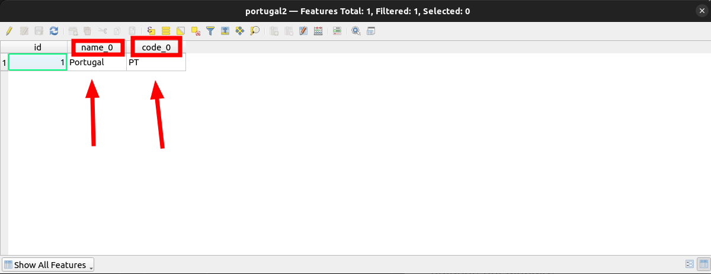
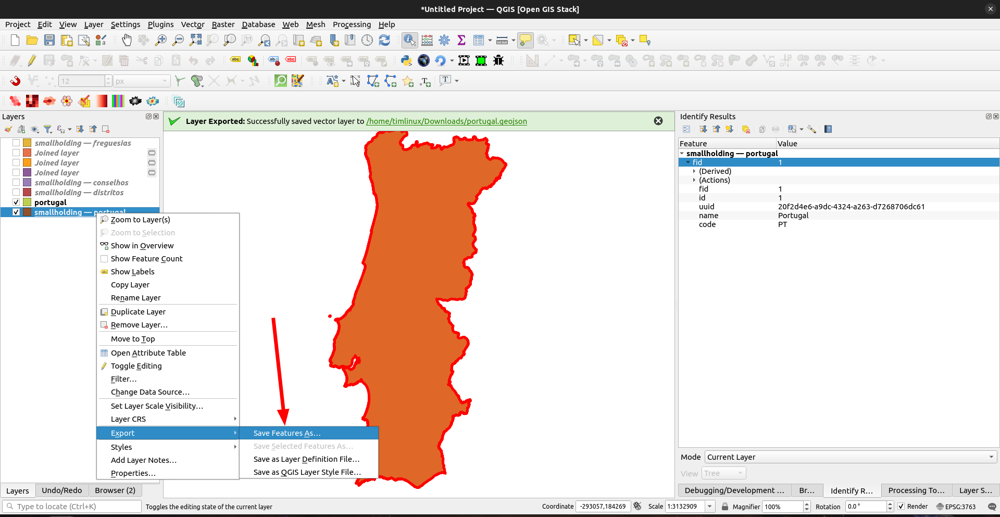
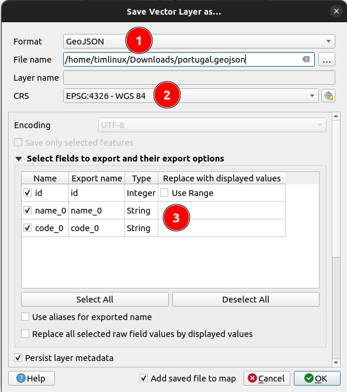
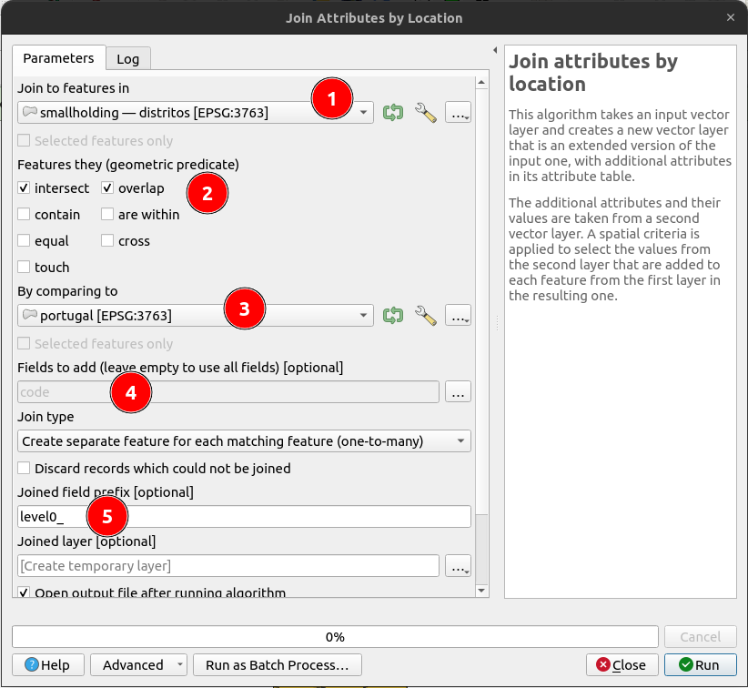
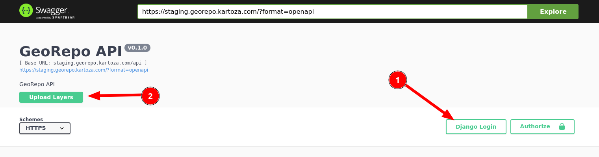

[//]: # "GeoSight is UNICEF's geospatial web-based business intelligence platform."
[//]: # 
[//]: # "Contact : geosight-no-reply@unicef.org"
[//]: # 
[//]: # ".. note:: This program is free software; you can redistribute it and/or modify"
[//]: # "    it under the terms of the GNU Affero General Public License as published by"
[//]: # "    the Free Software Foundation; either version 3 of the License, or"
[//]: # "    (at your option) any later version."
[//]: # 
[//]: # "__author__ = 'irwan@kartoza.com'"
[//]: # "__date__ = '13/06/2023'"
[//]: # "__copyright__ = ('Copyright 2023, Unicef')"
[//]: # "__copyright__ = ('Copyright 2023, Unicef')"

# Reference Layers

Geosight integrates with Georepo to provision vector tiles for administrative boundaries into the dashboards we display.

## Data Preparation

We will prepare two admin levels here.

### Admin Level 0

First prepare your data table. Here is an example country table:

Each table should have at minimum a name column (1) and a pcode column (2). A pcode is just a unique short abbreviation of the area name. The pcode only needs to be unique within the dataset, not globally.

These column names should follow the format of:

``name_prefix`` + ``level``
``code_prefix`` + ``level``

You may use any prefix you like, but the same prefix should be used in each layer. For example:

Level 0:

``name_`` + ``0``
``code_`` + ``0``

Level 1:

``name_`` + ``1``
``code_`` + ``1``

The lower order tables need to reference the parent areas to which they belong.

> Check above, may not be needed.

Once your table is prepared, use the QGIS layer context menu to export the layer:

Then export the layer, ensuring at least the name and pcode columns are included in the GeoJSON export:

Make sure you set:

1. The output format to GeoJSON
2. The output CRS to EPSG:4326
3. Select the PCODE in the list of attributes to be exported

### Admin Level 1

In this layer we need to have names and pcodes for each district. We will also need to add a colum containing the pcode of the parent (Level 0) layer so that we can establish the relationship between the layers.

In QGIS we can use the processing tool ``Join attributes by location`` to add the Level 0 pcode to the Level 1 layer.

Note the following options that are set here:

1. The level 1 layer that needs to have a country level pcode added to it.
2. The spatial predicate to use. Usually ``ìntersect`` and ``overlap`` would be used here.
3. The upper level layer to join to (Level 0 in this case).
4. Fields to add - usually just the pcode of the layer being joined to.
5. Prefix for the joined field. Adding the level as a prefix will help.

After generating the joined layer, you should have something like this:

As in Level 0, you should export the layer as GeoJSON.

## Uploading the layers

Now we are going to upload the layer to GeoRepo. First you need to go to the site which is currently here:

<https://staging.georepo.kartoza.com>

> This link will change when we enter into production.

First log in to the Georepo platform (1). If you do not have an account there, you need to first contact the site administrators to ask for access. Once you are logged in, use the upload button (2) to upload your boundaries as a GeoJSON dataset.

You can upload layers in a heirarchy using the uploader - you need to link the different levels with the layer and pcode level options. This is most easily explained via a short example:

> This user interface is in very early development, it will change and become more user friendly as we build the platform.
