# Documentation

## Overview 

Welcome to the instructions for those wishing to contribute to our documentation!

Our documentation system is based on the popular [mkdocs](https://www.mkdocs.org/) system. We encourage you to read the upstream documentation from mkdocs for the finer details of how mkdocs. In particular, read [this page](https://www.mkdocs.org/user-guide/writing-your-docs/) before you get to work. Mkdocs is not hard, but it may feel initially a little different if you are used to creating your documentation in word.

We use mkdocs because it has some great and useful features. Most especially:

* The code and the documentation are versioned together. This means that for whatever version of the code we have in our production release, we can be sure the documentation matches that release. We can also look back at changes over time through the version history when needed.
* It can render beautiful static (not needing a backend server) web sites with great features like search, styling, intuitive navigation etc.
* It can optionally render PDF documents from the same source markdown.
* An ecosystem of plugins and themes makes mkdocs really flexible and extensible.

### Some terminology

In our documentation, we have organised the information using a specific nomenclature:

* **guide**: A guide is a multi-step workflow / tutorial that leads your through common activities.
* **manual**: A collection of documents that describe each part of the project in a matter of fact way without presupposing any specific workflow is being undertaken.

For each of the main topic areas (user, admin, developer, devops, api user) we provide guides and manuals as is appropriate.

### Organisation

The documentation is organised in the following structure:

```
src
├── about
│   ├── code-of-conduct.md
│   ├── contributing.md
│   ├── disclaimer.md
│   ├── img
│   │   └── naming-convention.README
│   ├── index.md
│   ├── license.md
│   └── running-instances.md
├── administrator
│   ├── guide
│   │   └── index.md
│   ├── index.md
│   └── manual
│       ├── img
│       │   └── naming-convention.README
│       └── index.md
├── developer
│   ├── api
│   │   ├── guide
│   │   │   └── index.md
│   │   ├── index.md
│   │   └── manual
│   │       └── index.md
│   ├── documentation
│   │   ├── img
│   │   │   └── naming-convention.README
│   │   └── index.md
│   ├── guide
│   │   ├── architecture.md
│   │   ├── building.md
│   │   ├── cloning.md
│   │   ├── configuration.md
│   │   ├── design.md
│   │   ├── ide-setup.md
│   │   ├── img
│   │   │   └── naming-convention.README
│   │   ├── index.md
│   │   ├── prerequisites.md
│   │   ├── roadmap.md
│   │   ├── templates
│   │   │   ├── commit-message-convention.md
│   │   │   └── pull-request-template.md
│   │   └── workflows.md
│   ├── img
│   │   └── naming-convention.README
│   ├── index.md
│   └── manual
│       ├── index.md
│       └── README.txt
├── devops
│   ├── guide
│   │   └── index.md
│   ├── img
│   │   └── naming-convention.README
│   ├── index.md
│   └── manual
│       └── index.md
├── img
│   ├── favicon.ico
│   ├── KartozaBackgroundBorder.png
│   ├── logo.png
│   ├── logo.svg
│   ├── naming-convention.README
│   └── screenshot.png
├── index.md
└── user
    ├── guide
    │   └── index.md
    ├── img
    │   └── naming-convention.README
    ├── index.md
    ├── manual
    │   ├── home.md
    │   ├── img
    │   │   └── naming-convention.README
    │   └── index.md
    └── quickstart
        └── index.md
```

## File naming conventions

Please follow these conventions when writing your documentation:

1. Write file names in all lower case, with hyphens separating words (no spaces). e.g. ``important-file.md`` not ``Important File.md`` or other deviations.
2. Place the image files in the img folder adjacent to your content.
3. Do not abbreviate any words in file names - but try to use terse, descriptive names.
4. Place your content into the appropriate place as outline in the structure above.

## Contributing to the documentation

To start adding to the documentation navigate to the [home page](https://github.com/unicef-drp/GeoSight-OS) of the repository.

Once on the repository home page, (1) click on Fork
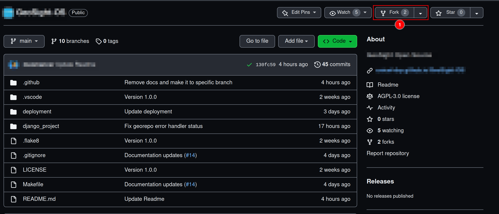

On the next page (1) Make sure your github account is selected as the owner and (2) make sure you untick the option to  "**Copy the** `main` **branch only**" as you want to copy all branches.
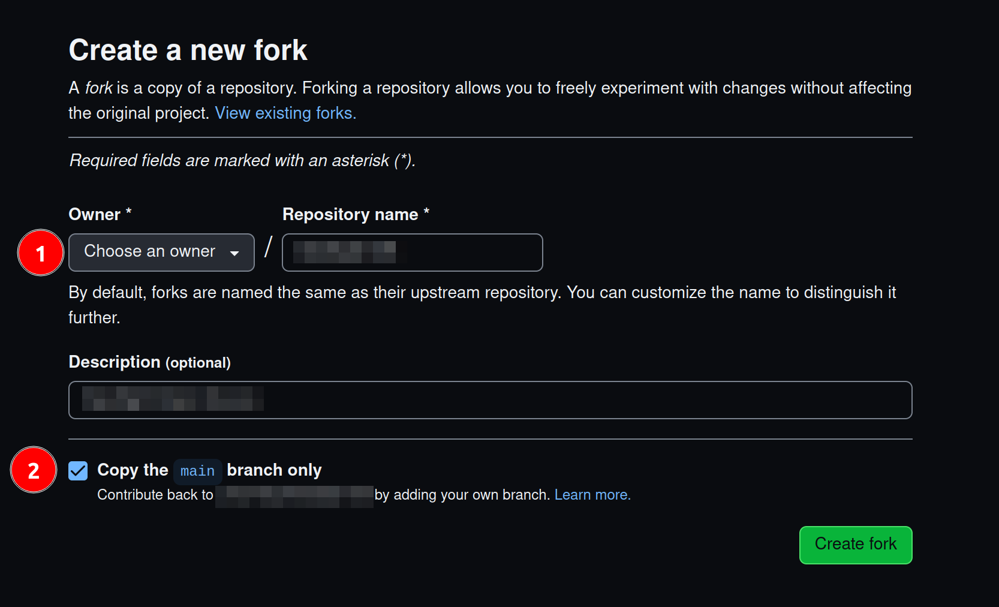

Once you have forked the repository, (1) click on the drop down menu underneath the repository title and then (2) click on the `docs` branch.
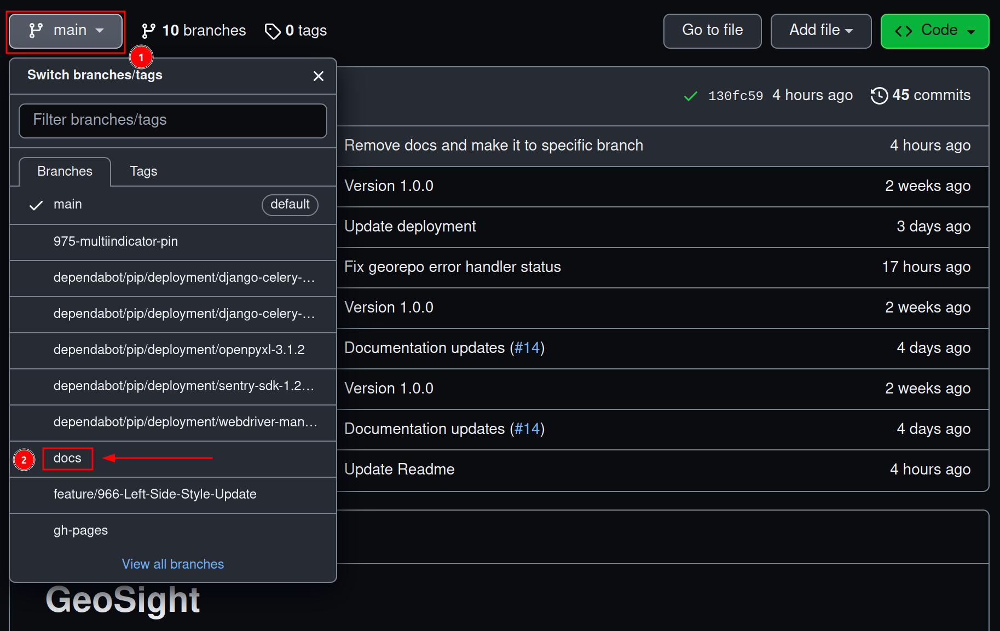

Once you are in the `docs` branch on your fork of the repository, click on `.` on your keyboard. This will open a web editor where you can begin adding to, or editing, the documentation.


Once the editor loads, you will be greeted by (1) a preview of the project's README.txt. (2) Click on the `docs` directory in the menu on the left, this will expand the directory. To confirm that you are working in the right branch (3) it will say `docs` in the bottom left of the editor.
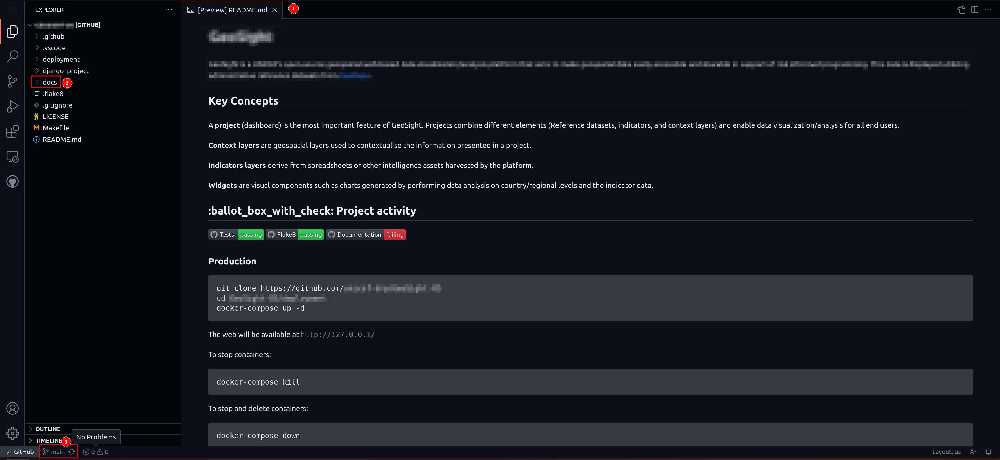

Once you have expanded the `docs` directory, (1) click on the `src` directory. All sub-directories within the `src` directory contain the files that become the documentation. Each sub-directory contains an `index.md` file that is required for the building of the documentation and static site. If you add a new sub-directory into any folder it must also contain a populated `index.md` file.
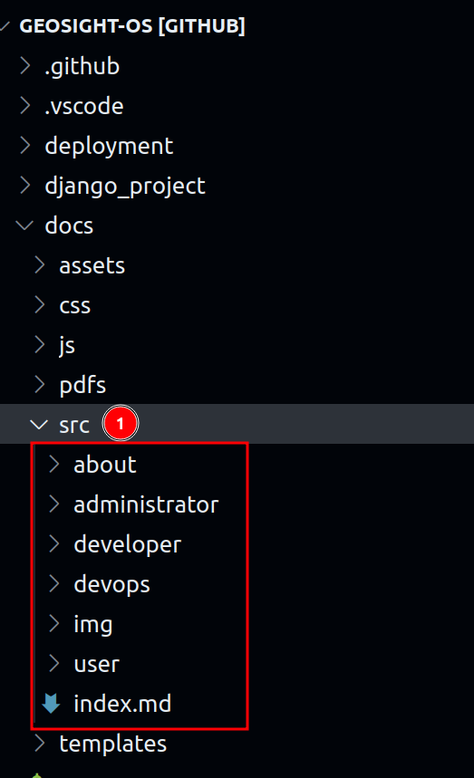

Once you have chosen which section of documentation you would like to edit (e.g. user/guide/index.md), click on the file and it will open in the web editor.


Once you have the file open, you can start adding to the documentation using [Markdown](https://www.markdownguide.org/) syntax. If you need to add images to your documentation, add them to the relative `img` sub-directories following the naming conventions set out in the `naming-convention.README` within the `img` folders.
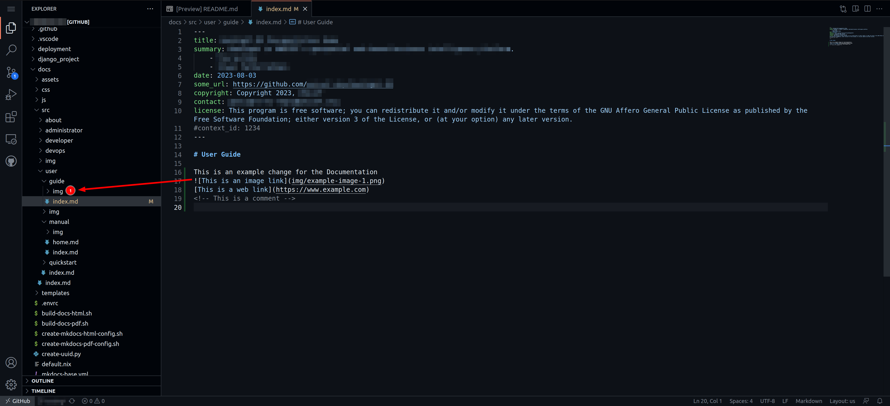

When you have completed making additions to (or editing) the documentation, (1) click on the source control tab then (2) click on the `plus` symbol next to the changes you are finished with to stage them, (3) add a commit message that is associated with the work you have done, and the (4) Click on `Commit & Push`
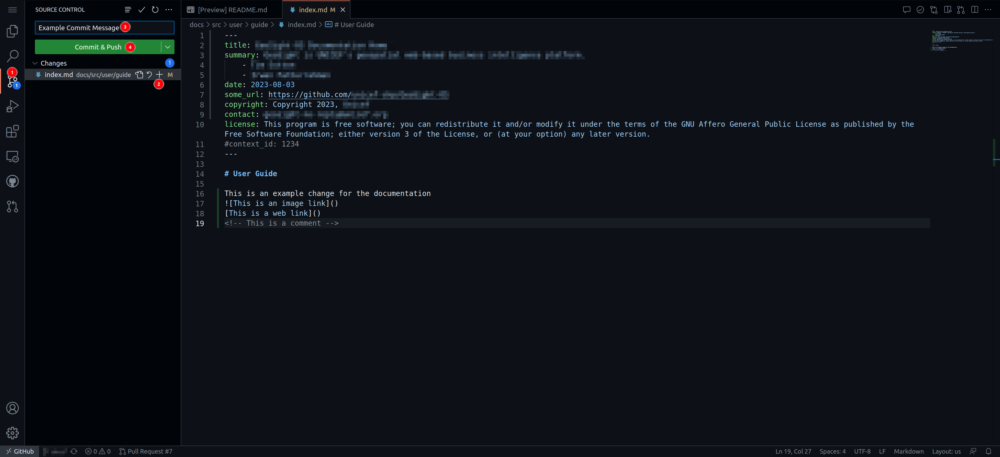

Once you have committed your changes, (1) Click on the burger menu and then (2) click on `Go To Repository`
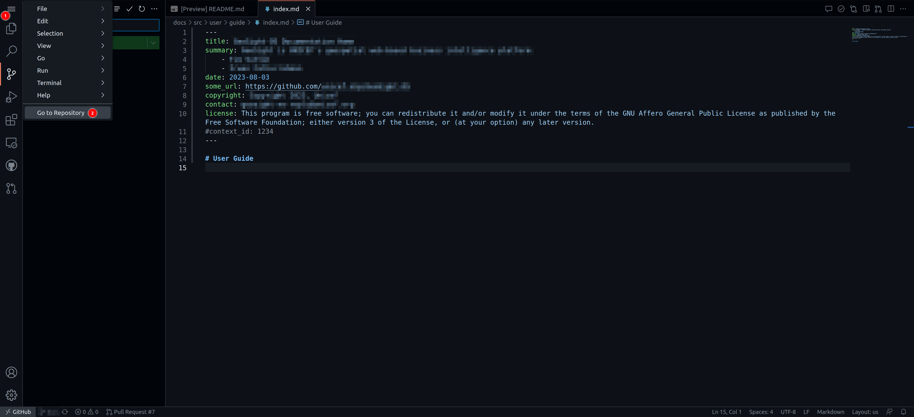

Your fork of the repository will be opened in a new tab within your browser, navigate to that tab. Once there (1) switch to the docs branch, you should see how many commits ahead of the upstream branch you are, then (2) click on `Contribute`-> `Open pull request`.
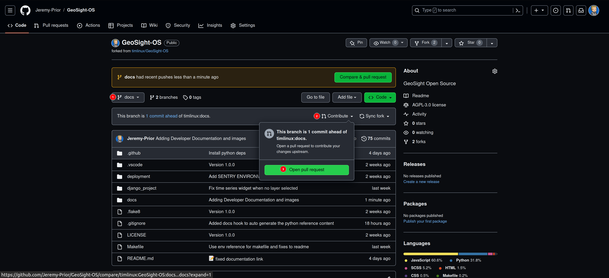

On the next screen, (1) give your pull request a meaningful title, (2) give additional details regarding changes made in the larger text box, then (3) click on `Create pull request`. Also ensure you are creating a pull request to the upstream `docs` branch from your `docs` branch.
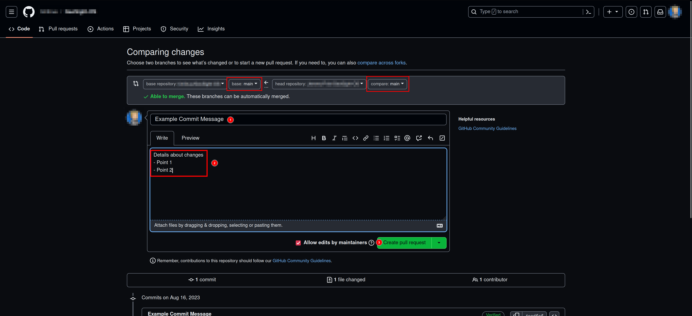

Once your pull request is opened you need to wait for it to be merged before you can open a new one.

## Technical notes

### Working locally

If you want to work with the documentation locally (i.e. directly on your PC), you need to follow this general process:

1. Install python
2. Install pip
3. Install the python modules listed in docs/requirements.txt
4. If you are on Linux or macOS, open the docs directory in a shell and run ``build-docs-html.sh``
5. In the docs directory, run ``mkdocs serve``
6. Open your web browser at https://localhost:8000 to view the rendered docs.

Note that ``mkdocs serve`` will dynamically re-render the docs any time you make a change. The process above is illustrated in the diagram below:

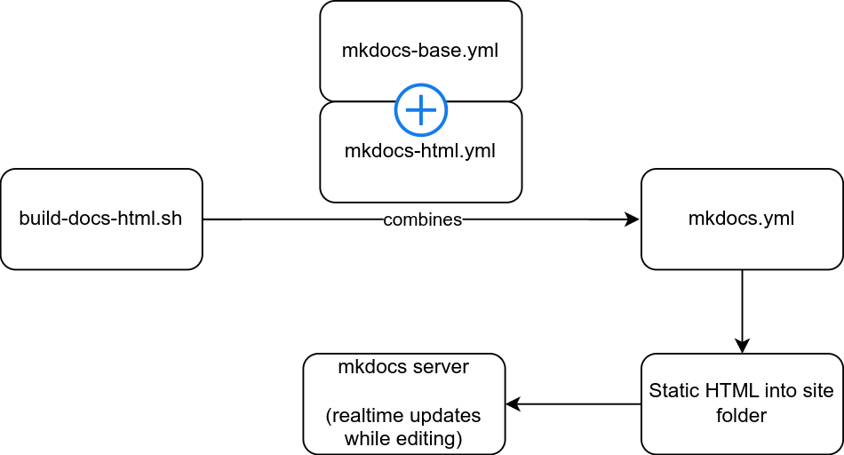

### Hooks

We implement two hooks (plugins for mkdocs that are invoked during the docs rendering process).

* **uuid_redirects_hook.py** - this is used to handle page redirects from a uuid - see below for more details
* **python_manual_hook.py** - this is used to auto-generate the reference guide for the python modules, classes and functions that make up the code base for this project.

### Permalinks for user and admin docs

If you are a developer, you should be aware of the workflow for creating user and administrator documentation for each page you create.

Every page should have a help link on it that leads to the appropriate manual page. The workflow for doing this is:

1. Generate a new page UUID using the provided python utility e.g. ``./create-uuid.py``
2. Create a new page in the appropriate manual section e.g. ``docs/src/user/manual/login.md``
3. In the metadata section at the top of the page, add the context id e.g. ``context_id: V4cVEFd2TmwYJVb5HvWRwa``
4. In your django view, set up your help button to point to the site url and your context id. e.g. ``https://siteurl/V4cVEFd2TmwYJVb5HvWRwa``

Whenever the user visits the page using the UUID URL, they will be redirected to the correct page e.g. ``https://siteurl/login/``. This system protects us from file renaming and reorganising on the site, and ensures that the help link will always remain valid.


### Generating PDFS

To generate PDFS, `cd` into `GEOSIGHT-OS/docs` and then run the `build-docs-pdf` in a local terminal

### Generating Static Site

To generate HTML, `cd` into `GEOSIGHT-OS/docs` and then run the `build-docs-html` in a local terminal.
You can then run `mkdocs serve` to generate the static site on your local host, if there is a port conflict you can specify the port using the `-a` flag e.g `mkdocs serve -a 127.0.0.1:8001`.
