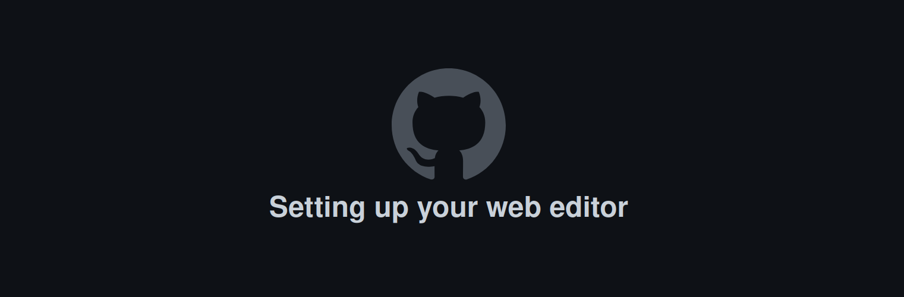
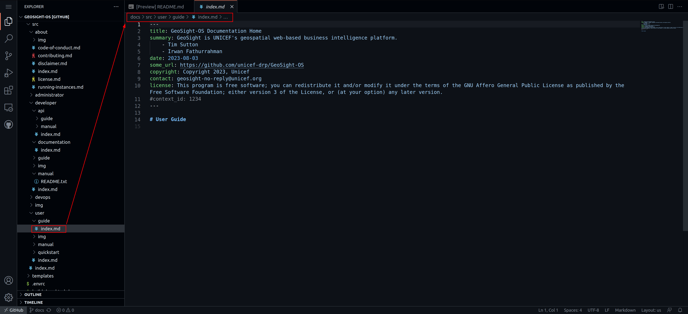

# Documentation

## Overview

Welcome to the instructions for those wishing to contribute to our documentation!

Our documentation system is based on the popular [mkdocs](https://www.mkdocs.org/) system. We encourage you to read the upstream documentation from mkdocs for the finer details of how mkdocs works. In particular, read [this page](https://www.mkdocs.org/user-guide/writing-your-docs/) before you get to work. Mkdocs is not hard, but it may feel initially a little different if you are used to creating your documentation in word.

We use mkdocs because it has some great and useful features. Most especially:

* The code and the documentation are versioned together. This means that for whatever version of the code we have in our production release, we can be sure the documentation matches that release. We can also look back at changes over time through the version history when needed.
* It can render beautiful static (not needing a backend server) web sites with great features like search, styling, intuitive navigation etc.
* It can optionally render PDF documents from the same source markdown.
* An ecosystem of plugins and themes makes mkdocs really flexible and extensible.

### Some terminology

In our documentation, we have organised the information using a specific nomenclature:

* **guide**: A guide is a multi-step workflow / tutorial that leads you through common activities.
* **manual**: A collection of documents that describe each part of the project in a matter of fact way without presupposing any specific workflow is being undertaken.

For each of the main topic areas (user, admin, developer, devops, api user) we provide guides and manuals as is appropriate.

### Organisation

The documentation is organised in the following structure:

```
src
├── about
│   ├── code-of-conduct.md
│   ├── contributing.md
│   ├── disclaimer.md
│   ├── img
│   │   └── naming-convention.README
│   ├── index.md
│   ├── license.md
│   └── running-instances.md
├── administrator
│   ├── guide
│   │   ├── img
│   │   │   └── naming-convention.README
│   │   └── index.md
│   ├── img
│   │   └── naming-convention.README
│   ├── index.md
│   └── manual
│       ├── img
│       │   └── naming-convention.README
│       └── index.md
├── developer
│   ├── api
│   │   ├── guide
│   │   │   ├── img
│   │   │   │   └── naming-convention.README
│   │   │   └── index.md
│   │   ├── img
│   │   │   └── naming-convention.README
│   │   ├── index.md
│   │   └── manual
│   │       ├── img
│   │       │   └── naming-convention.README
│   │       └── index.md
│   ├── documentation
│   │   ├── img
│   │   │   └── naming-convention.README
│   │   └── index.md
│   ├── guide
│   │   ├── architecture.md
│   │   ├── building.md
│   │   ├── cloning.md
│   │   ├── configuration.md
│   │   ├── design.md
│   │   ├── ide-setup.md
│   │   ├── img
│   │   │   └── naming-convention.README
│   │   ├── index.md
│   │   ├── prerequisites.md
│   │   ├── roadmap.md
│   │   ├── templates
│   │   │   ├── commit-message-convention.md
│   │   │   └── pull-request-template.md
│   │   └── workflows.md
│   ├── img
│   │   └── naming-convention.README
│   ├── index.md
│   └── manual
│       ├── img
│       │   └── naming-convention.README
│       ├── index.md
│       └── README.txt
├── devops
│   ├── guide
│   │   ├── img
│   │   │   └── naming-convention.README
│   │   └── index.md
│   ├── img
│   │   └── naming-convention.README
│   ├── index.md
│   └── manual
│       ├── img
│       │   └── naming-convention.README
│       └── index.md
├── img
│   └── naming-convention.README
├── index.md
└── user
    ├── guide
    │   ├── img
    │   │   └── naming-convention.README
    │   └── index.md
    ├── img
    │   └── naming-convention.README
    ├── index.md
    ├── manual
    │   ├── home.md
    │   ├── img
    │   │   └── naming-convention.README
    │   └── index.md
    └── quickstart
        ├── img
        │   └── naming-convention.README
        └── index.md
```

## File naming conventions

Please follow these conventions when writing your documentation:

1. Write file names in all lower case, with hyphens separating words (no spaces). e.g. ``important-file.md`` not ``Important File.md`` or other deviations.
2. Place the image files in the `img` folder adjacent to your content.
3. Do not abbreviate any words in file names - but try to use terse, descriptive names.
4. Place your content into the appropriate place as outlined in the structure above.
5. Each file should only contain one level-one heading e.g. ``# Page title``
6. Headings and subheadings should be written as a terse phrase starting with a capital letter and subsequent words in lower case unless they are proper nouns. Do not place a colon after the heading.
7. Use unicode number markers to reference numbers in images e.g. 1️⃣
8. Every heading / subheading should have a single line underneath it summarising the content that will follow. This sentence will be used in the help center in the application to give the user a reference point for the text that will follow. It also makes the help text more consistent and readable.
9. For every section that contains images, the first image will be used as the thumbnail if the heading is referenced from the application.

<!-- Break for formatting reasons -->
:pencil2: **Note:** *The repo name in the images below is blurred out, you should work against the GeoSight-OS repository when following these notes.*
<!-- Break for formatting reasons -->
:pencil2: *Additionally **read** the text part of the instructions, **do not** just use the images as pictorial instructions!*

## Contributing to the documentation

To start adding to the documentation navigate to the [home page](https://github.com/unicef-drp/GeoSight-OS) of the repository.

Once on the repository home page, click on Fork 1️⃣


On the next page, make sure your github account is selected as the owner 1️⃣ and make sure the "**Copy the** `main` **branch only**" option 2️⃣ is ticked as you will only need the main branch.


Once you have forked the repository, ensure that you are working in the main branch.


Once you are in your fork of the repository, click on `.` on your keyboard. This will open a web editor where you can begin adding to, or editing, the documentation. The screen below should appear until the editor loads.



Once the editor loads, you will be greeted by a preview of the project's README.txt 1️⃣. Click on the `docs` folder 2️⃣ in the menu on the left, this will expand the folder. To confirm that you are working in the right branch it will say `main` 3️⃣️ in the bottom left of the editor. Also ensure that you are in the `Explorer` tab 4️⃣ of the web editor.


Once you have expanded the `docs` folder, click on the `src` folder 1️⃣. All subfolders within the `src` folder contain the files that become the documentation. Each subfolder contains an `index.md` file that is required for the building of the documentation and static site. If you add a new subfolder into any folder it must also contain a populated `index.md` file, this will be further explained in the **Creating new files** section.


Once you have chosen which section of documentation you would like to edit (e.g. user/guide/index.md), click on the file and it will open in the web editor.



Once you have the file open, you can start adding to the documentation using [Markdown](https://www.markdownguide.org/) syntax. If you need to add images to your documentation, add them to the relative `img` subfolders following the naming conventions set out in the `naming-convention.README` within the `img` subfolders (e.g. images for the *User Guide* would be added to the `user/guide/img/` subfolder 1️⃣). Adding images is explained further in the **Uploading images / media** section further down the page.


> **Hint:** *You can click on the `naming-convention.README` file to view it and, in turn, read the image naming conventions. Just remember to switch back to the document that you are working on!*

When you have completed making additions to (or editing) the documentation, click on the source control tab 1️⃣, then click on the `plus` symbol 2️⃣ next to the changes you are finished with to stage them, add a commit message 3️⃣️ that is associated with the work you have done, and then click on `Commit & Push` 4️⃣.


Once you have committed your changes, Click on the burger menu 1️⃣ and then click on `Go To Repository` 2️⃣.


Your fork of the repository will be opened in a new tab within your browser, navigate to that tab (your browser might block pop ups, so you might need to manually open the pop up to get back to your fork of the repository). Once there, ensure you are on the `main` 1️⃣ (you should see how many commits ahead of the upstream branch you are), then click on `Contribute` 2️⃣ -> `Open pull request` 3️⃣️.


On the next screen, give your pull request a meaningful title 1️⃣, give additional details regarding changes made in the larger text box 2️⃣, then click on `Create pull request` 3️⃣️. Also ensure you are creating a pull request to the upstream `main` branch from your `main` branch.


Once your pull request is opened you need to wait for it to be merged before you can open a new one.

## Creating new files

Open the Web Editor by clicking on `.` on your keyboard when you are on your fork of the repository. The screen below should appear until the editor loads.


Navigate to the relative subfolder within the `src` folder to which you would like to add a new file. (e.g. `src` -> `user` -> `manual`). Also ensure that you are in the `Explorer` tab 1️⃣ of the web editor.


Once you have selected a subfolder, click on the `New File...` button 1️⃣ to the right of the repository name.


Give your file a meaningful name (following the **File naming conventions** from above) and end the file name with **`.md`** to ensure that the file is saved as a markdown file. Once you have given your file a name, click `Enter` on your keyboard to finish creating it.


Once you have created a new file, you can start adding to the documentation using [Markdown](https://www.markdownguide.org/) syntax. You must add a header section to each new file! Please read the **Page metadata** section below regarding adding the standard header to new files.


If you need to add images to your documentation, add them to the relative `img` subfolders following the naming conventions set out in the `naming-convention.README` within the `img` subfolders (e.g. images for the *User Guide* would be added to the `user/guide/img/` subfolder 1️⃣). Adding images is explained further in the **Uploading images / media** section further down the page.


> **Hint:** *You can click on the `naming-convention.README` file to view it and, in turn, read the image naming conventions. Just remember to switch back to the document that you are working on.*

When you have completed making additions to (or editing) the documentation, click on the source control tab 1️⃣, then click on the `plus` symbol 2️⃣ next to the changes you are finished with to stage them, add a commit message 3️⃣️ that is associated with the work you have done, and the click on `Commit & Push` 4️⃣.


Once you have committed your changes, Click on the burger menu 1️⃣ and then click on `Go To Repository` 2️⃣.


Your fork of the repository will be opened in a new tab within your browser, navigate to that tab (your browser might block pop ups, so you might need to manually open the pop up to get back to your fork of the repository). Once there, ensure you are on the `main` 1️⃣ (you should see how many commits ahead of the upstream branch you are), then click on `Contribute` 2️⃣ -> `Open pull request` 3️⃣️.


On the next screen, give your pull request a meaningful title 1️⃣, give additional details regarding changes made in the larger text box 2️⃣, then click on `Create pull request` 3️⃣️. Also ensure you are creating a pull request to the upstream `main` branch from your `main` branch.


Once your pull request is opened you need to wait for it to be merged before you can open a new one.

### Page metadata

Whenever you create a new file, you should add the standard header (below) to the top of the file:
**Note:** *You need to copy the entire header including the `---` at the top and bottom of the header*

```
---
title: GeoSight-OS Documentation 
summary: GeoSight is UNICEF's geospatial web-based business intelligence platform.
    - Tim Sutton
    - Irwan Fathurrahman
date: 2023-08-03
copyright: Copyright 2023, Unicef
contact: geosight-no-reply@unicef.org
license: This program is free software; you can redistribute it and/or modify it under the terms of the GNU Affero General Public License as published by the Free Software Foundation; either version 3 of the License, or (at your option) any later version.
#context_id: 1234
---
```

The easiest way to add the standard header to your file is to highlight the **entire** header (above), and then press `ctrl` and `c` on your keyboard. Navigate to your file in the web editor, then click in the top of your file and press `ctrl` and `v` on your keyboard.

The summary can be updated to include your name for documents you contribute to.

The context_id is used to create a unique permalink to this document, and is optional. See further down in this document for more details.

### Navigation

:pencil2: You need to have read through the [mkdocs](https://www.mkdocs.org/) documentation to understand this section entirely.

All pages need to be added to the 'nav' section of the `mkdocs-base.yml` file. This will ensure that it is available in the menus and that mkdocs renders without errors. For example, if you wish to add a new page to the User Guide area, in 'nav' you would add a line like this:

`- Navigating the map: users/guide/map-navigation.md`

Sometimes you may not wish to have the new page displayed in the menu system this can be useful when, for example, it is accessed via a link in another page. In these cases, leave the menu entry part blank e.g.

`- "": users/guide/map-navigation.md`

Mkdocs will still generate the page but it will not be added to the menu.

## Uploading images / media

**Note:** *If you wish to upload a gif, or a small video, you can follow the same steps as below (GitHub does limit the upload size to 10 MB).*

All folders and subfolders should contain an `img` subfolder (e.g. `user/guide/img/`) containing a `naming-convention.README`.
If you add a new folder, then you should add a new `img` subfolder and copy a `naming-convention.README` from another existing `img` subfolder into your newly created folder.


To upload an image, right-click on the relative `img` subfolder and select `upload` from the menu that appears.


Select an image from your computer, using the file explore that opens, and then click on the `Open` Button 1️⃣ (The attached screenshot is from a Linux machine however, Windows also has an open button).


If your image does not follow the naming conventions, right-click on the image, click on `Rename...` on the menu that appears, and then give your image an appropriate name.


Useful tools for capturing images and screencasts are: Peek (For screencasts), Flameshot (For images), Shutter (For images), and Lightshot (For images)

## Technical notes

### Working locally

If you want to work with the documentation locally (i.e. directly on your PC), you need to follow this general process:

1. Install python
2. Install pip
3. Install the python modules listed in docs/requirements.txt
4. If you are on Linux or macOS, open the docs directory in a shell and run ``build-docs-html.sh``
5. In the docs directory, run ``mkdocs serve``
6. Open your web browser at https://localhost:8000 to view the rendered docs.

Note that ``mkdocs serve`` will dynamically re-render the docs any time you make a change. The process above is illustrated in the diagram below:


### Hooks

We implement two hooks (plugins for mkdocs that are invoked during the docs rendering process).

* **uuid_redirects_hook.py** - this is used to handle page redirects from a uuid - see below for more details
* **python_manual_hook.py** - this is used to auto-generate the reference guide for the python modules, classes and functions that make up the code base for this project.

### Permalinks for user and admin docs

If you are a developer, you should be aware of the workflow for creating user and administrator documentation for each page you create.

Every page should have a help link on it that leads to the appropriate manual page. The workflow for doing this is:

1. Generate a new page UUID using the provided python utility e.g. ``./create-uuid.py``
2. Create a new page in the appropriate manual section e.g. ``docs/src/user/manual/login.md``
3. In the metadata section at the top of the page, add the context id e.g. ``context_id: V4cVEFd2TmwYJVb5HvWRwa``
4. In your django view, set up your help button to point to the site url and your context id. e.g. ``https://siteurl/V4cVEFd2TmwYJVb5HvWRwa``

Whenever the user visits the page using the UUID URL, they will be redirected to the correct page e.g. ``https://siteurl/login/``. This system protects us from file renaming and reorganising on the site, and ensures that the help link will always remain valid.


### Generating PDFS

To generate PDFS, `cd` into `GEOSIGHT-OS/docs` and then run the `build-docs-pdf` in a local terminal

### Generating static site

To generate HTML, `cd` into `GEOSIGHT-OS/docs` and then run the `build-docs-html` in a local terminal.
You can then run `mkdocs serve` to generate the static site on your local host, if there is a port conflict you can specify the port using the `-a` flag e.g `mkdocs serve -a 127.0.0.1:8001`.
