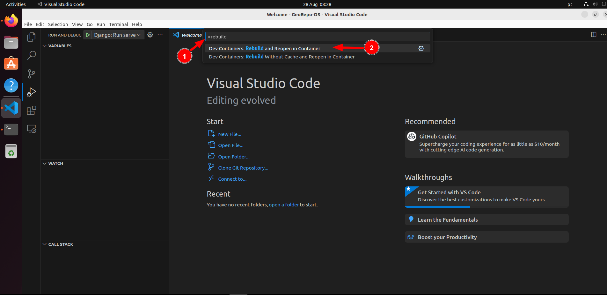
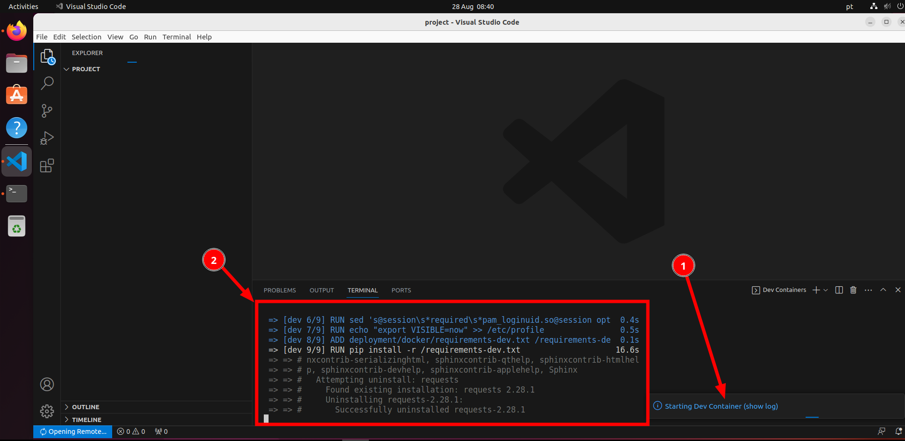
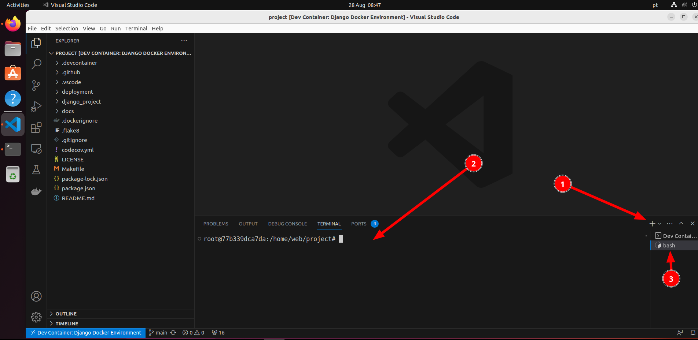
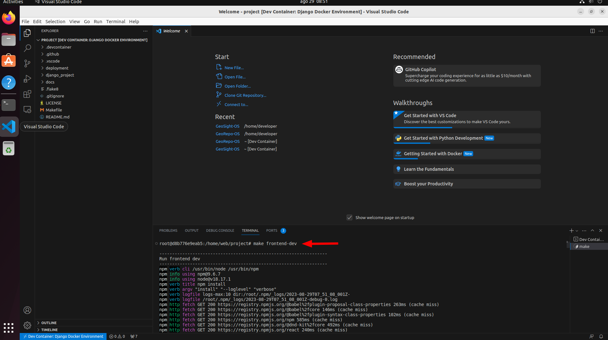
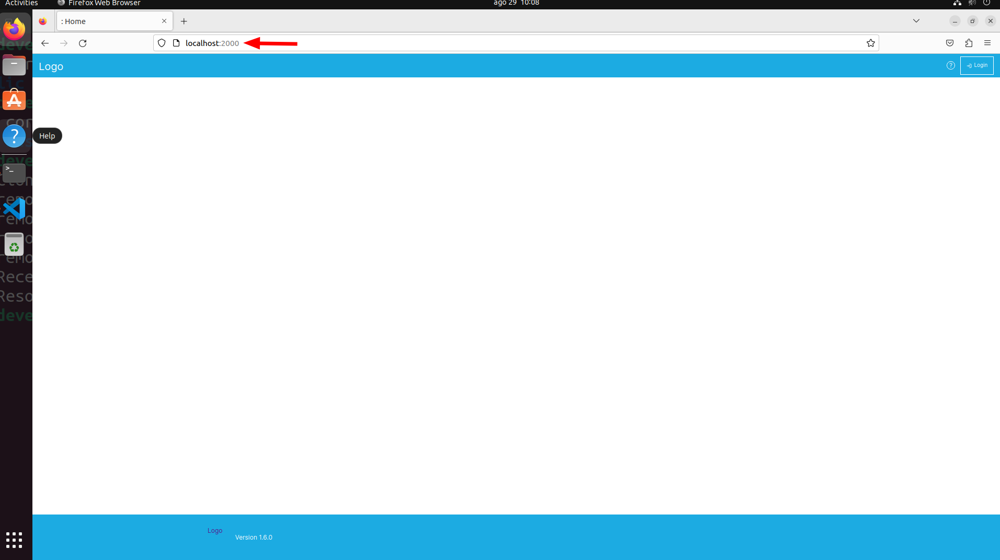

# Building the dev environment

This section covers the process of building and running the application from your IDE.

🚩 Make sure you have gone through the [IDE Setup Process](ide-setup.md) before following these notes.

Press `Ctrl -> P` 1️⃣ and then `>`and search for `Rebuild`. Select `Dev Containers: Rebuild and Reopen in Container`2️⃣. This will essentially mount your code tree inside a docker container and switch the development context of VSCode to be inside the container where all of the python etc. dependencies will be installed.



Once the task is running, a notification 1️⃣ will be shown in the bottom right of the VSCode window. Clicking in the notification will show you the setup progress 2️⃣. Note that this make take quite a while depending on the internet bandwidth you have and the CPU power of your machine.


## Open a dev container terminal

Open  terminal within the dev container context by clicking the `+`icon in the terminal pane 1️⃣. The new terminal 2️⃣ will show up in the list of running terminals 3️⃣



## Install FrontEnd libraries

```
make frontend-dev
```




## Run django migration

```
cd /home/web/project/django_project
python manage.py migrate
```
## Create super user

```
cd /home/web/project/django_project
python manage.py createsuperuser
```

During this process you will be prompted for your user name (defaults to root), email address and a password (which you need to confirm). Complete these as needed.


## Viewing your test instance

After completing the steps above, you should have the development server available on port 2000 of your local host:

```
http://localhost:2000
```



The site will be rather bare bones since it will need to be configured in the admin area to set up the theme etc.