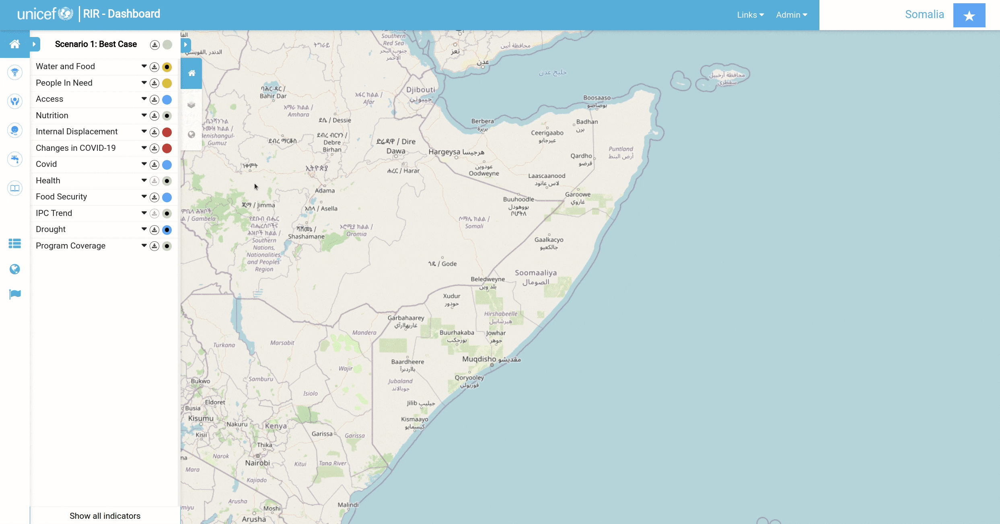

[//]: # "GeoSight is UNICEF's geospatial web-based business intelligence platform."
[//]: # 
[//]: # "Contact : geosight-no-reply@unicef.org"
[//]: # 
[//]: # ".. note:: This program is free software; you can redistribute it and/or modify"
[//]: # "    it under the terms of the GNU Affero General Public License as published by"
[//]: # "    the Free Software Foundation; either version 3 of the License, or"
[//]: # "    (at your option) any later version."
[//]: # 
[//]: # "__author__ = 'irwan@kartoza.com'"
[//]: # "__date__ = '13/06/2023'"
[//]: # "__copyright__ = ('Copyright 2023, Unicef')"
[//]: # "__copyright__ = ('Copyright 2023, Unicef')"

# Indicator

## Adding a New Indicator
To add an indicator, click on **Indicator Management** and go to **Create New**. Fill in the necessary information about the indicator you would like to create. 
Once you have filled out the form, scroll down to Scenario Rules and add the parameters to match the indicator. you can also change the colour for each rule
by clicking on the colour block. Click **Submit** once you are happy with the added information and scenario rules. 

If you add a dashboard link, you will see a black dot in the centre of the circle that represents the scenario case on that indicator in the 'Program Interventions' panel. By clicking on the black dot,
you will be redirected to the dashboard link.

## Add a New Indicator from Existing One
Sometimes we need to create multiple indicators with the same configurations with just different names. To do this, we can create a new indicator from the existing one. 
To do that, go to **Indicator Management**, click the **cog** icon and click **Create from This**, and it will be redirected to the form with pre-configuration from the last selected indicator.

## Edit Indicator
To edit the indicator, go to **Indicator Management**, click the **cog** icon and click **Edit**, and it will be redirected to the form where we can change the configuration of an indicator.

## Edit Multiple Indicator
Sometimes we need to update multiple indicators because they have the same configurations. To do it, go to **Indicator Management**, and click the **Multi-Edit**. 
There will be a checkbox where we can check the indicators that we needed. After we check the indicators, click **Multi-Edit Form**, and it will be redirected to the form and fill some fields if they have the same configurations.
To change a configuration, we need to check the checkbox before the input label, and the input will be turned on, and we can change the configuration value.

## Show/hide Indicators
To show or hide the indicator on the dashboard, go to **Indicator Management**, and just turn it on/off by clicking the ‘Eye’ icon.

## Change order indicator and group
In the dashboard, the indicators show in the ordered list and group. To change the orders and the group, go to **Indicator Management**, click **Change order** and 
drag and drop the group to the new order, or indicator to the new order or also to the new group.

## Value Manager Form
There are two ways to manually add data to indicators. The first is by using the 'Value Manager Form'. To access this form, go to **Indicator Management** and 
scroll to the indicator that you would like to add data. On the right-hand side of the indicator's name, there will be a small Settings symbol.
Click on **Settings** for the desired indicator and then click on **Value Manager Form**. You will be redirected to a form that gives you all the geographic 
locations within the instance and spaces to add values. You can also add a file to fill in the data by clicking **Use File to Refill Form**

## Value Manager Map
The second way to add data to an indicator is through the 'Value Manager Map' option. Go to **Indicator Management** and scroll to the indicator that you would
like to add data. On the right-hand side of the indicator's name, there will be a small **Settings** symbol. Click on **Settings** for the desired indicator and
then click on **Value Manager  Map**. This will take you back to the map canvas. Now you will be able to click on any geographic location within the instance 
and a popup window will appear which will allow you to fill in value data for that location.

## Harvesters
The process of creating a harvester is for the total automation fetching of data. Go to **Indicator Management** and if you haven't already created the indicator you want to work with, start by doing that. Once the necessary indicator exists, 
click on the little **Settings** icon on the right-hand side of the indicator name. Select the **Create Harvester** option. Pick the type of harvester you would
like to create from the drop-down 'Harvester' (you will be presented with three options: 'API With Geography Using Today's Date'; 'API With Geography And Date'; and 
'Harvested Using Exposed API By External Client'). The first two options are for the harvester and the third one is for the ingestor. For the **API With Geography Using Today's Date** and **API With Geography And Date** options,  fill in the Attributes portion of the form and then a popup window with a list of 
keys will appear; drag the green labels to their corresponding criteria. Double-check that in 'Geometry Mapping', 'From' matches 'To'. Select **Harvest Now**. You can 
scroll down to the log to see if your harvest is running in the background. Go to **Indicator Management** and click on the little settings icon that you just 
created a harvester for and select **Value Manager Map** to view your progress.

To create a 'Meta Harvester', go to **Indicator Management** and in the top right-hand corner of the page, there will be a **Meta Harvester** option that you will 
need to select. Fill in 'Sheet name', 'Column name: administration code', and add the appropriate file. **Submit** your work. Click **Report File** to view your work.

## Ingestors
The function of an ingestor is to manually upload data which is then automatically ingested or pushed from a remote side. To start, click on **Create Harvester**
as you did for the harvester options. Change the type of harvester to **Harvested using exposed API by external client**. Add necessary notes and **submit**.
You will now be presented with an 'API URL' and a 'Token' that has been received from an external source. You now need to push the data from outside to the RIR 
dashboard. Open the API platform that you use to build and use API's. We used Postman. Copy over the URL and token to push the data to the RIR dashboard.

