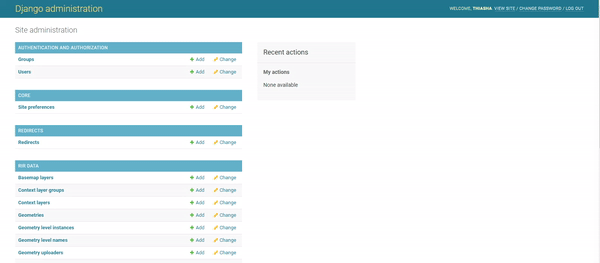

[//]: # "GeoSight is UNICEF's geospatial web-based business intelligence platform."
[//]: # 
[//]: # "Contact : geosight-no-reply@unicef.org"
[//]: # 
[//]: # ".. note:: This program is free software; you can redistribute it and/or modify"
[//]: # "    it under the terms of the GNU Affero General Public License as published by"
[//]: # "    the Free Software Foundation; either version 3 of the License, or"
[//]: # "    (at your option) any later version."
[//]: # 
[//]: # "__author__ = 'irwan@kartoza.com'"
[//]: # "__date__ = '13/06/2023'"
[//]: # "__copyright__ = ('Copyright 2023, Unicef')"
[//]: # "__copyright__ = ('Copyright 2023, Unicef')"

# User Management

This section is used for managing the users for the website

## User Creation
Go to **site administration**. Click on **+Add** in the same row as Users. You can now create a profile for someone by adding a username and password. Once you have created the user profile, click **Save**.

## User Permissions

Once you have created the user account, go back to **Site Administration** and select the **user** option. Select the user you created, and then you can edit their personal information as well as select or deselect their ‘Permissions’. Remember to **Save** your changes.

You also can change the permission in user creations.

