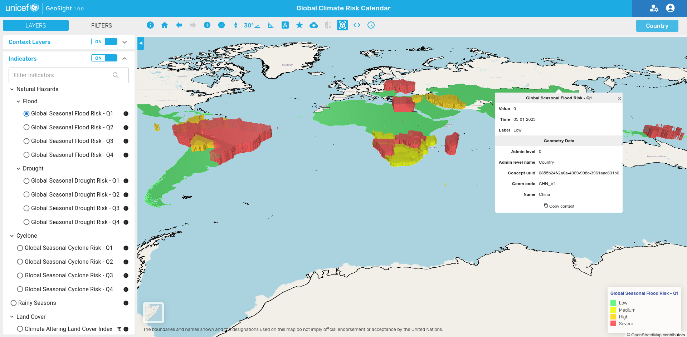
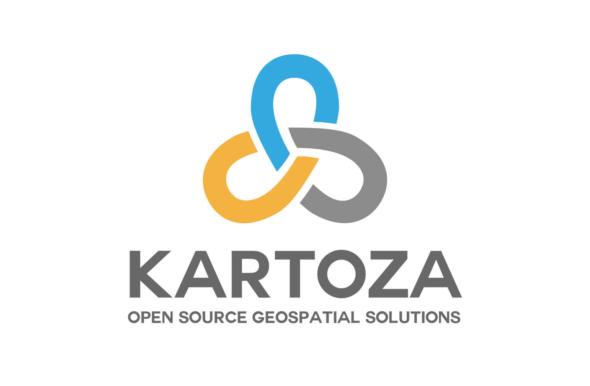

[//]: # "GeoSight is UNICEF's geospatial web-based business intelligence platform."
[//]: # 
[//]: # "Contact : geosight-no-reply@unicef.org"
[//]: # 
[//]: # ".. note:: This program is free software; you can redistribute it and/or modify"
[//]: # "    it under the terms of the GNU Affero General Public License as published by"
[//]: # "    the Free Software Foundation; either version 3 of the License, or"
[//]: # "    (at your option) any later version."
[//]: # 
[//]: # "__author__ = 'irwan@kartoza.com'"
[//]: # "__date__ = '13/06/2023'"
[//]: # "__copyright__ = ('Copyright 2023, Unicef')"

# GeoSoght

GeoSight is a UNICEF’s open-source geospatial web-based data visualization/analysis platform that aims to make geospatial data easily accessible and sharable in support of risk informed programming. This data is displayed utilizing administrative reference datasets from [GeoRepo](https://github.com/unicef-drp/GeoRepo-OS).

## Key Concepts

A **project** (dashboard) is the most important feature of GeoSight. Projects combine different elements (Reference datasets, indicators, and context layers) and enable data visualization/analysis for all end users. 

**Context layers** are geospatial layers used to contextualise the information presented in a project.

**Indicators layers** derive from spreadsheets or other intelligence assets harvested by the platform.

**Widgets** are visual components such as charts generated by performing data analysis on country/regional levels and the indicator data.

## Introduction

The GeoSight platform was developed to help organisations with operational planning. It 
harvests and aggregates data linked to management areas (e.g. national and subnational boundaries).
These data can then be visualized as choropleth maps. Widgets (charts, tables, summaries) can be
displayed in association with the currently active indicator layer.

There are two main areas for the platform:

* the projects area - this is where users open and explore data in projects that have been created for them to support their operational work.
* the managagement area - this is where projects are designed. Data sources are selected and the reporting areas and components are configured.

<!-- Insert introduction paragraphs here -->
<!-- Can also input short video demo of project here (YouTube link, etc) -->
<!-- Can contain Purpose/Why of project and the Scope of Project without use of sub-headings-->

### Purpose

### Scope of Project

### Project Roadmap

[Project Roadmap]()
<!-- Either insert link to roadmap or actual roadmap (Speak to team leads) -->

#### Code of Conduct

<!-- Insert link to Code of Conduct -->
Our community in this project is aligned with our [Code of Conduct](about/code-of-conduct.md) - please be sure to read and abide by that document in all interactions with out community.

#### Diversity Statement

<!-- Insert link to Diversity Statement -->
[Diversity Statement]()

## Project Partners

<!-- Insert Project Partner Logos and/or Links -->

[Project Partner 1]()

#### Releases

<!-- Insert links to release pages -->
[GitHub releases page]()
[Releases page]()

| | **Project Badges** | |
| ----------------------- | ----------------------- | ----------------------- |
|  |  |  |
|  |  |  |

#### Project Chatroom

<!-- Insert links to chatroom pages if available, otherwise remove -->
[Chatroom]()

#### Contributor License Agreement (CLA)
<!-- Insert links to CLA -->
[Contributor License Agreement]()

#### License

[License]() <!-- Link to project license in about page -->

<!-- Keep the Kartoza Logo at the bottom of the page if the project allows -->

