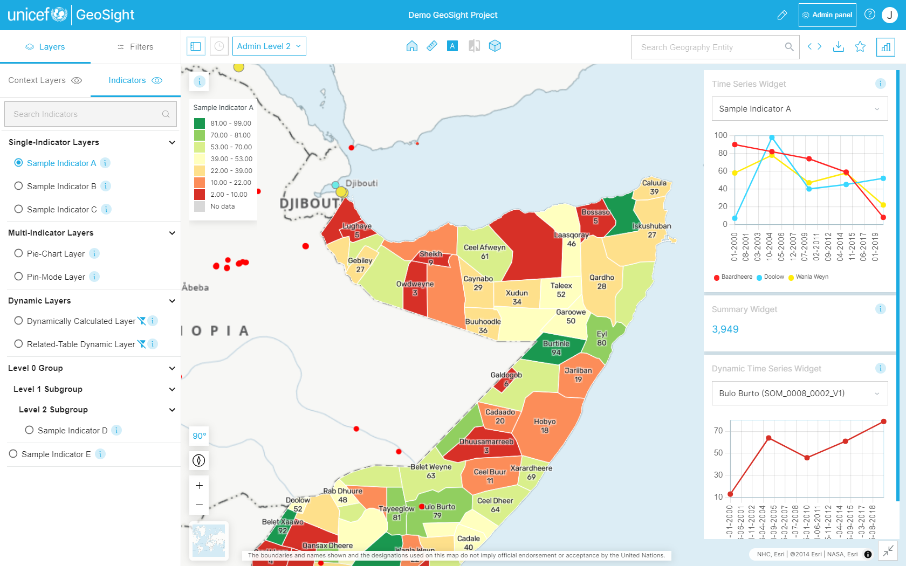

# GeoSight

GeoSight is an open-source web geospatial data platform developed by UNICEF for easy data visualization and analysis. It is specifically designed to simplify the creation of online maps for visualizing multiple indicators at a subnational level to support evidence-based decision-making for better results for children. This data is displayed utilizing reference boundaries pulled dynamically from [GeoRepo](https://github.com/unicef-drp/GeoRepo-OS).

## Overview

The GeoSight platform was developed to help UNICEF Country Offices in emergency response and operational planning. It 
harvests and aggregates data linked to administrative areas (e.g. national and subnational boundaries).
These data can then be visualized as choropleth or pie chart maps. Widgets (charts, tables, summaries) can be
displayed in association with the currently active indicator layer.

There are two main interfaces of the platform:

* the dashboard view - this is where end users open and explore data in projects that have been created for them to support their operational work.
* the admin area - this is where projects are designed and data can be managed. Data sources are selected and the reporting areas and components are configured.

## Key Concepts

A **Project** (dashboard) is the most important feature of GeoSight. Projects combine different elements (reference datasets, indicators, and context layers) and enable data visualization/analysis for all end users. 

**Indicators layers** derive from spreadsheets or other intelligence assets harvested by the platform. They visualize specific Indicator(s) on the map, using choropleth method (color-coded boundaries) or charts (pie or bar charts).

**Context layers** are geospatial layers pulled from external web mapping services (ArcGIS Online/Portal, WMS, GeoJSON etc) used to contextualise the information presented in a project.

**Widgets** are visual components such as charts generated by performing data analysis on country/regional levels and the indicator data.

## Disclaimer
	

The software provided by this project is provided 'as is'. All information provided 
within the platform should be independently verified before using as the basis for
action. The contributors and developers of this platform take no responsibility
for any loss of revenue, life, physical harm or any other adverse outcome that may 
occur as a result of the use of this platform. 

## Scope of Project

Our scope is to create a robust, information rich platform for visualisation of
data at the level of administrative units.

## Project Roadmap

### Contributing

We would love to collaborate with you! But first, please read our [contributor
guidelines](about/contributing.md) which describe how to report
issues, plan and contribute feature additions etc.

### Code of Conduct

Our community in this project is aligned with our [Code of
Conduct](about/code-of-conduct.md) - please be sure to read and abide by that
document in all interactions with out community.

### Diversity Statement

This project welcomes and encourages participation by everyone.

No matter how you identify yourself or how others perceive you: we welcome you.
We welcome contributions from everyone as long as they interact constructively
with our community.

While much of the work for our project is technical in nature, we value and
encourage contributions from those with expertise in other areas, and welcome
them into our community.

## Project Partners

## Releases

Our releases are published on our [GitHub releases page](https://github.com/unicef-drp/GeoSight-OS/releases)

| | **Project Badges** | |
| ----------------------- | ----------------------- | ----------------------- |
|  |  |  |
|  |  |  |

#### Project Chatroom

We do not yet have a [Chatroom]() set up for this project. Please use the GitHub issue tracker for discussions rather.

#### Contributor License Agreement (CLA)

Contributions to this project will be subject to our [Contributor License Agreement]() (Coming soon)

#### License

This project is open source, published under the AGPL-3. 
You can read our license to find out what rights this license bestows to users and contributors.

[License](about/license.md)

