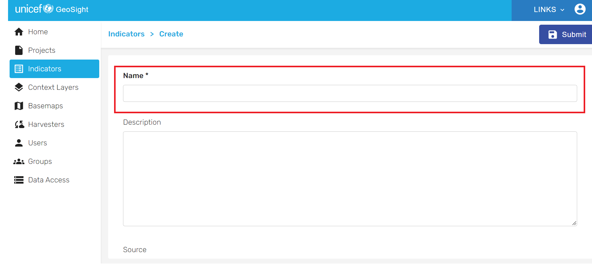
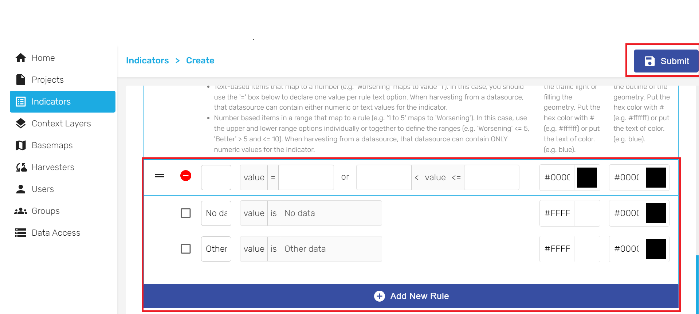
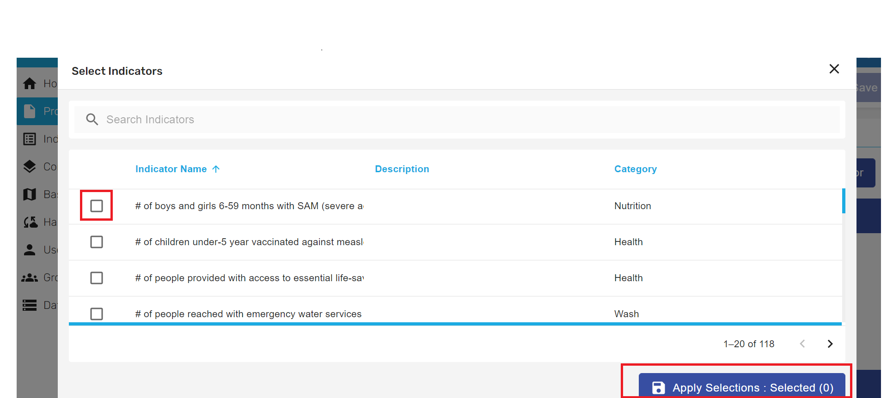

[//]: # "GeoSight is UNICEF's geospatial web-based business intelligence platform."
[//]: # 
[//]: # "Contact : geosight-no-reply@unicef.org"
[//]: # 
[//]: # ".. note:: This program is free software; you can redistribute it and/or modify"
[//]: # "    it under the terms of the GNU Affero General Public License as published by"
[//]: # "    the Free Software Foundation; either version 3 of the License, or"
[//]: # "    (at your option) any later version."
[//]: # 
[//]: # "__author__ = 'irwan@kartoza.com'"
[//]: # "__date__ = '13/06/2023'"
[//]: # "__copyright__ = ('Copyright 2023, Unicef')"
[//]: # "__copyright__ = ('Copyright 2023, Unicef')"

# Adding and managing indicators 

## Adding and stylizing an indicator in GeoSight

### Adding an indicator to GeoSight

The first step will be to add an indicator to the platform and assigning it a style depending on its values.
To start the process, navigate to the GeoSight main webpage and click on "Admin'.

Under the "Indicator" panel to the left, click on "Add new Indicator" on the top right. 

A new form will appear. Here you will give your indicator a **Name** and specify the **category** it belongs to, as well as the **aggregation method** to be performed on higher-level administrative units: if you select "Aggregate data by average data in the levels", the values of higher-level units (e.g., regions) will be calculated as averages of all the lower-level units contained in them (e.g., districts). Optionally you can also add a brief description, a source and a unit.

### Stylizing an indicator

Stylizing an indicator is a key operation. **Without stylization, an indicator will not appear on a project even if it is correctly loaded on GeoSight.**

To stylize an indicator, go to the bottom of the form and select "Add new rule". Here you can select either one of two options: assign a colour to a specific value (e.g., green to the value "0") or to a range of values (e.g., green to all values <20). The first option is ideal for a dataset with few discrete values, while the second is best for a dataset with a normal continuous distribution. 

Finally, click **Submit**. The indicator will now be listed among the indicators on GeoSight.

Once you have completed this tutorial, the indicator will automatically show up on the project with the style you have assigned it.

## Filling an indicator with data

Now that you have added an indicator, you will need to fill it with data. To do so, go back to the list of indicators under the "Indicator" panel and select the indicator you just added in the list. Next, click on the "Management form" icon to the right of the "Value list" button.

A new form will appear. First, select the **geographic extent** and the **administrative level** of your indicator. If your dataset is global, select "World" in the first dropdown menu. A list of world countries will automatically appear down below.

While you can add values manually, the fastest and most practical solution is to use a pre-compiled master sheet. To select your source data, click on "Use file to refill form".

A new popup will appear. Here you can select your **spreadsheet** under "Choose File", the **area code column** (which will be used to univocally assign the rows in your spreadsheet to the correct corresponding administrative units on GeoSight) and the **value column**. Optionally you can choose extra columns as additional values to be shown in the indicator page. 

**The present version of GeoSight only supports .csv or .xls data. Other extensions such as .dbf will have to be converted beforehand.**

At the end, click "Apply". Your indicator will now be filled with data and ready to be added to a project.

## Adding an indicator to a project on GeoSight

Now that your indicator is ready, **you can add it into any project you want**.

To add an indicator to a project, navigate to the "Projects" pane, select the project where you want the indicator to be visualized, click on the "Indicator" tab and tick the box next to your indicator. You can select more than one indicator. Finally, click on "Apply Selections".

Your indicator will now be visible on a project. 
