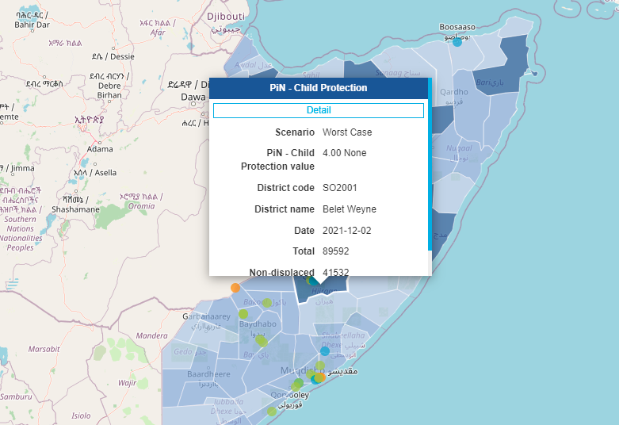

[//]: # "GeoSight is UNICEF's geospatial web-based business intelligence platform."
[//]: # 
[//]: # "Contact : geosight-no-reply@unicef.org"
[//]: # 
[//]: # ".. note:: This program is free software; you can redistribute it and/or modify"
[//]: # "    it under the terms of the GNU Affero General Public License as published by"
[//]: # "    the Free Software Foundation; either version 3 of the License, or"
[//]: # "    (at your option) any later version."
[//]: # 
[//]: # "__author__ = 'irwan@kartoza.com'"
[//]: # "__date__ = '13/06/2023'"
[//]: # "__copyright__ = ('Copyright 2023, Unicef')"
[//]: # "__copyright__ = ('Copyright 2023, Unicef')"

# Map Interactions

The GeoSight map interaction tools give an interactive map experience. Users are able to zoom and pan to areas of interest and display information information in just a few clicks.

## Zoom In and Out

Zooming into an area on the map is useful to show a specific area of interest and to see more detail.

To Zoom in or out on the map canvas either scroll your mouse up and down or use Ctrl+shift+click and drag an square around the area you wish to zoom in on.

## Move Around the Map

Navigating or panning around the map is useful to focus on specific areas of interest.

To pan, `click` the mouse on the map canvas and while holding the click drag the map to the desired area of interest.

## Information Display Window

To gain information on a specific area within the map, "click" on that area with your mouse.
By clicking on an area, a popup window with information related to your selected layers for that area will be displayed on the screen.
This action will also change the info window in the ‘Summary Tab' to the ‘Indicators Tab'.
You can also view more details by "clicking" on ‘details’ in the popup window. This will also change the info window’s tab to the ‘Details Tab'.
