[//]: # "GeoSight is UNICEF's geospatial web-based business intelligence platform."
[//]: # 
[//]: # "Contact : geosight-no-reply@unicef.org"
[//]: # 
[//]: # ".. note:: This program is free software; you can redistribute it and/or modify"
[//]: # "    it under the terms of the GNU Affero General Public License as published by"
[//]: # "    the Free Software Foundation; either version 3 of the License, or"
[//]: # "    (at your option) any later version."
[//]: # 
[//]: # "__author__ = 'irwan@kartoza.com'"
[//]: # "__date__ = '13/06/2023'"
[//]: # "__copyright__ = ('Copyright 2023, Unicef')"
[//]: # "__copyright__ = ('Copyright 2023, Unicef')"

# User Tutorial

🧑‍🏫 The Geosight platform is a situational awareness platform to monitor health, child protection, nutrition, water, sanitation, hygiene, and education in a geographic region. It provides powerful but simple geospatial data analysis tools to provide insights about the situation on the ground. In this section will explain how the Geosight platform works using simple examples and workflows that an everyday platform user would use.

## Working with this documentation

Whenever you see a phrase in **bold**, it refers to a link or button on the user interface that you can interact with.

### Important Links

* [Geosight Platform](https://staging.geosight.kartoza.com/ "Geosight Platform")
* [Geosight Full Documentation](https://unicef-drp.github.io/GeoSight/ "Geosight Full Documentation")

### Session Outline

1. Access the platform
2. **Documentation** and **Links**
3. **Projects**
4. **Sign in**
5. The Dashboard tour:

* **The Context Analysis Button**
* **Programme Interventions Panel**
* **The Indicator Panel**
* **Hiding and showing panels**
* **The Traffic Light**
* **The Information Panel**
* **Downloading Data button**

    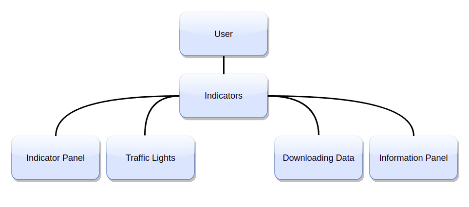

    (See also [Indicators](https://kartoza.github.io/Geosight-dashboard/pages/using/indicators.html#indicators)).

6. Layers

* The **Context Layers Icon**
* The **Basemap Icon**
* **Geography Level Panel**

    

    (see also [Layers](https://kartoza.github.io/Geosight-dashboard/pages/using/layers.html#layers)). We will look at these layer related topics:
  
1. Map Interactions

* **Panning** moving around the map
* **Zooming** in and out
* The **Information Display Window**
* **The Map Slider** (eg. to compare people in need of 'Child Protection' vs. 'Child Protection Program Coverage')
* **Timelapse Bar**(eg. IDP arrival over time)

(see also [Map Interactions](https://kartoza.github.io/Geosight-dashboard/pages/using/map_interactions.html))

2. More on the **Information Panel**

* **Graphical Representation**

3. Questions

You can find more self-study content in the full system documentation here: [Platform Tour](https://kartoza.github.io/Geosight-dashboard/pages/using/platform_tour.html)).

## Tutorial

### Accessing the platform

You can access the platform here: <https://staging.Geosight.kartoza.com>:

> 📒 **Note** this link will change in the future. We will advise all users of the system when that happens.

### Documentation

🧑‍🏫 On the top right-hand side of the landing screen, there is a drop-down menu for **Links** and a link to a sign-in page. The **Links** drop-down menu is a quick way to access the documentation for using the platform and the different data and resources associated with the platform (which are not covered in this tutorial).

> 📒 **Instructor note:** Briefly show the documentation and how to navigate it.

### Instances

🧑‍🏫 On the landing page, you will see several **instances**. An **Instance** is a configured dashboard for a specific region or country. We will use the **Somalia instance** for the examples in this tutorial.

### Signing In

🧑‍🏫 Return to the Geosight platform, click on the **Sign In** link, and a page will open where you can add in your user name and password. Your credentials are created for you by an administrator and may not be necessary. As a web user, you will still be able to interact with the platform without a login.

🧑‍🏫 **Sign In** is only important to access specific workflows. Some data and workflows may only be available to named users who are signed into the platform. Once you are signed in to the platform, your name will appear on the top right, and depending on your admin privileges, there will be a drop-down with the option to log out and reach the admin page if you are an administrator.

### The Somalia Dashboard

👨‍🏫 Click on the **instance** labeled Somalia, and the dashboard will load and open.

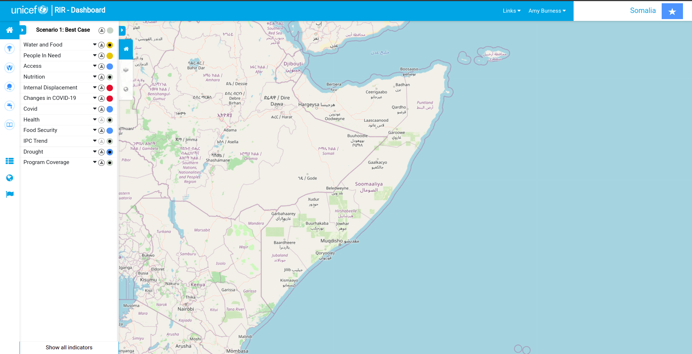

🧑‍🏫 You will see I am still signed in, and there are three options available to me on the bottom left. If I sign out, these buttons will disappear because web users do not have access to some functionality. For this tour, a web user status will work.

## Dashboard Tour

🧑‍🏫 Let's tour the dashboard together. We will start from left to right across the screen, showing what each button and panel does with a few simple examples.

### The Context Analysis Button

🧑‍🏫 At the top left of the screen, you will see the **Context Analysis Button**. This button gives access to the **Indicator Panel** it is selected, and the is panel open by default.

🧑‍🏫 Below the **Context Analysis Button** is the **Programme Interventions Panel**. It contains a set of buttons that allow access to key risk response indicators.

👨‍🏫 Click on the arrow next to the house symbol, the tabs will extend and be labeled so you can see what each symbol means, Health, Child Protection, Nutrition, Wash, and Education.

🧑‍🏫 For example, the second button-down with a picture of the caduceus/ medical symbol indicates **Health**. Once opened the panel shows a report on the status of or degree to which the intervention for that factor is helping and other information like costing.

👨‍🏫 Click on each button to see the information for each factor.

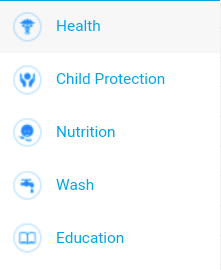

### The Indicator Panel

👨‍🏫 Click back on the **Context Analysis Button** and observe the **Indicator Panel**.

🧑‍🏫 This panel contains a list of **indicators** (special layers) that relate to the main factors of interest on the platform like health and nutrition. Indicators are special layers in Geosight that are linked to the situation in the region. Indicators are used to show the situation in the region. For example, in Somalia, there are indicators for the Children in need of protection **PIN- Child Protection** that we will practically explore below. The panel is expanded by default but can be collapsed if you click on the tab labeled with a house on the right side of the panel. Collapsing the pannel can allow you to observe the map better.

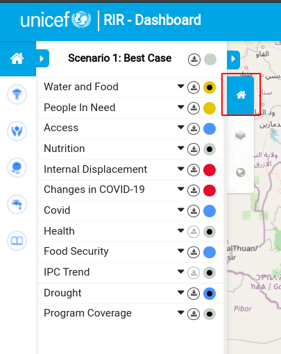

👨‍🏫 Click on the triangle next to the label **People In Need**.

🧑‍🏫 This opens a drop-down menu showing all the data on different groups of people that require assistance from government or other organizations.

👨‍🏫 Select the box next to **PIN- Child Protection**.

🧑‍🏫 A tick will appear in the check box and you will see a layer appear on the map. The map shows areas in darkening blue shades that indicate a decrease in child protection per region. You can select only one sub-layer (e.g. best-case or worst-case) of the **indicator** layer by ticking or un-ticking the **checkboxes** next to each of the cases.

👨‍🏫 Click and unclick the different case options (see how the map changes). Ensure all of the **PIN- Child Protection** sub-Layers are ticked to continue with the tutorial.

🧑‍🏫 An **Information panel** will also open on the right-hand side of the screen when an **indicator** is selected. We will go through the **Information Panel** in more detail shortly.

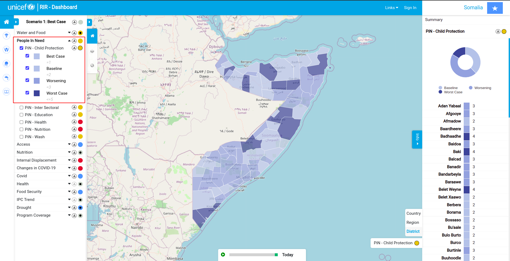

🧑‍🏫 The coloured circles next to each **indicator** show the current severity level for that indicator. Blue is the best case, yellow mid, and red is the worst case. The case scenario will indicate if that region or state needs additional responses or interventions to reduce risk.

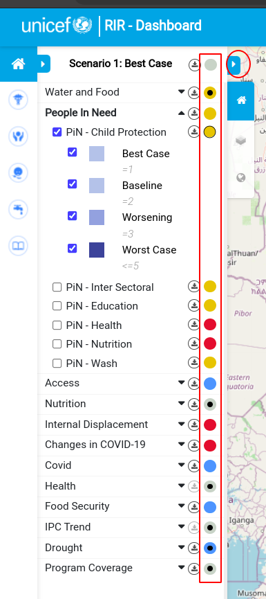

### The Traffic Light

🧑‍🏫 You can access what we call traffic lights for the indicators by clicking on the arrow in the top right of the **Indicator panel**. This will expand the information on the severity level, for example, you can see that for our selected layer of **PIN- Child Protection** overall in Somalia the situation is worsening for children hence the yellow color. Several regions need additional responses or support to protect vulnerable children. Click the triangle (now on the top right) again to see the map again.

👨‍🏫 Click on the arrow in the top right of the **Indicator panel**

### The Information Panel

🧑‍🏫 On the right-hand side of the map area, the **Information Panel** shows a summary of the severity case of the indicator selected for each region or district. For example in Adan Yabaal Child protection has a value of 3. You will also see an interactive **pie chart** infographic summarising all the data in the layer.

👨‍🏫 Hover your mouse over the **pie chart** and observe the labels and number of districts in Worsening and Worst Case scenarios.

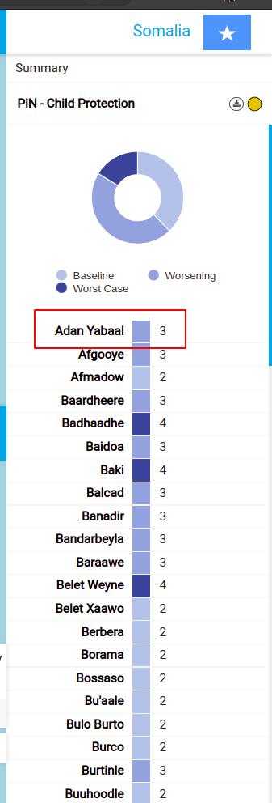

🧑‍🏫 If you click on the region name like Adan Yabaal in the **Information Panel** the platform will show which region it is on the map with an information window.

👨‍🏫 Click on Adan Yabaal (the text) in the **Information Panel** under the pie chart.

🧑‍🏫 Once a single district is selected, the **Information Panel** will show all the indicators for that specified region and the severity of the situation for each indicator using different traffic light colors. You can click on each indicator for more detail like Child protection and you will see more information and a simple infographic. We will look at the **Information Panel** with different data further on in this tutorial and show how the simple infographic in the detail section can show changes over time if the data has such information.

👨‍🏫 Click on **PiN-Child Protection** (the text) in the **Information Panel** and observe the information and simple Infographic and hover your mouse over it.  

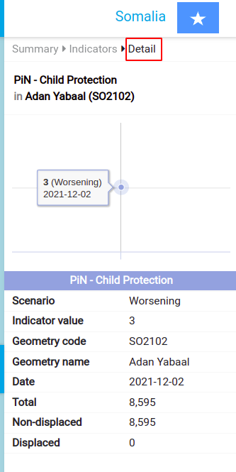

### Downloading Data Button

🧑‍🏫 You can download any data of interest by clicking on the round symbol with the download arrow in it (**download button**) next to each indicator in the **Indicator Panel** for the selected indicator. You can get all the data for the instance if you click **the download button** at the top of the **Information Panel**. This will give you a spreadsheet of the information that you can use outside of the platform.

👨‍🏫 Click on the **download button** next to **People In Need** and observe the downloaded spreadsheet on your computer. Note the data is also colour-coded in the spreadsheet as per the platform.  

## Layers

🧑‍🏫 Let's explore the layers available to visualize and give context to the indicators on the map.

### Context Layers

🧑‍🏫 The **context layers** can be accessed by clicking on the button with 3 overlapping squares on it.  There will be a list of options to choose from. Context layers are shown on the map to provide a sense of the conditions in the region. They can cover any topic - for example, security, food security, infrastructure, etc. Context layers do not have indicator data attached, they are a visual aid in the dashboard map. Let's Select ‘Access’ We can now see all the roads, airports, and other access indicators/features. If you click on the drop-down triangle you can choose exactly what features you want to see and Turn off everything except roads and ports by checking and unchecking the feature boxes. If you click on a point on the map like a port you will be given information about that specific point in an **Information Window**.

👨‍🏫 Click on the context layers button, select access layers select only roads and ports. Click on a port and see the information window.

### Base Maps

🧑‍🏫 You can also change the base map behind the data if you click on the world icon in the panel. The default is an OpenStreetMap canvas. There is also a GEBCO grid base map which is a global terrain model for ocean and land, a Mapbox satellite base map, and an open topo base map which is rendered from OSM and SRTM data.

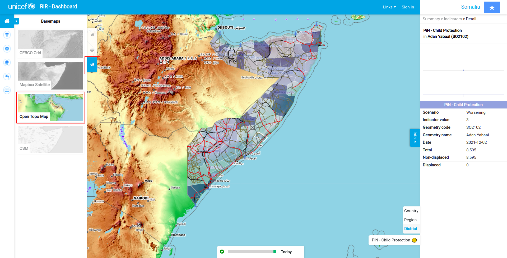

🧑‍🏫 For example, it may be useful to have a topographic map to visualize geographic features like mountains and rivers that could impede people's movement into areas if you are reviewing the internal displacement of people.

👨‍🏫 - turn on the Open **Topo Map** base map

* Navigate back to the indicator panel
* Uncheck the child protection layer.
* Click the drop-down for **Internal Displacement**
* select the **IDP Departure layer**

🧑‍🏫 You can now see some of the topographic features underneath the departures layer. You may observe that several areas with high departure rates are in the northern desert area. Thus drought may be affecting the people in these areas. Let's take it a step further and go to the contest layers again drop down the **Natural Hazard** option and check on the **Drought Priority Areas**. You can see that many of the drought priority areas are in the northern desert area we can see on the context topo map.

👨‍🏫 Navigate to the context layers and check on the **Drought Priority Areas**.

### Geography Level

🧑‍🏫 Finally, while we have the IDP data handy you can change the **Geography Level** of the indicators. By specifying country, region, or district in the menu on the bottom right of the map canvas. Geography levels express the hierarchy between administrative boundaries. For example, in Somalia, we have the country boundary subdivided into regions, which are in turn subdivided into districts. Geosight uses these geography levels to provide a sense of the conditions in the region.

👨‍🏫 - Turn off the **Acess layers** and the **Drought Priority Areas** by going to the layers and unchecking them so that we can see the regions better

* On the menu at the bottom right of the page select Region and you will see that the geographic level of the areas changes.
* click on Country and see what happens.

## Map Interactions

🧑‍🏫 Let's now get into interacting with the Map. Activate the child protection indicator again and deactivate departures.

👨‍🏫 Check on the **PIN- Child Protection** and check off the **IDP Departure layer**

### Zooming

🧑‍🏫 Zoom into and out of the map by using the scroll wheel on your mouse or you can click your mouse, hold down shift and draw a square around the area you wish to zoom in to.

### Panning

To pan on the map click on the map and drag it around.

### Information Window

Once you have zoomed and panned to an area of interest click on it and you will see an information window as we saw earlier. For more information click on the detail button and information will be shown in the **Information Panel** on the right. Click off the window to get out.

👨‍🏫 Zoom in, Pan, and click on a region of interest.

### The Slider

🧑‍🏫 You can choose two indicators for comparison on the map. For example, while child protection is selected let's see where there is program coverage for child protection in Somalia.

Under the **Program Coverage** indicator select the **Child Protection** option. You will see a slider appear and the layer names represented on each side on the bottom left and right of the screen. If you click on the middle toggle and drag you can see that in several of the regions in the north with the worst-case scenario for child protection there are no active programs to combat the issue depicted in red. These would be ideal candidates to fund child-relief projects in.

👨‍🏫 Check on the **Child Protection** indicator layer and drag the slider across the map.

🧑‍🏫 You can make the sliding horizontal by clicking the map button at the bottom right of the map canvas.

### Timelapse Bar

There is a **Timelapse Bar** that can show changes in data over time located at the bottom center of the screen or map area. A great example of this is the internal displacement of people. Turn off the child protection indicators and activate the IDP layer for departures. You can see where indicators are selected because the tab heading will be bolded. Click the play button on the time bar and you will see the changes in what region people are leaving over time.

👨‍🏫 Check the box on the **IDP Departure layer** and any other layers off. Click on the green play button on the timelapse bar.

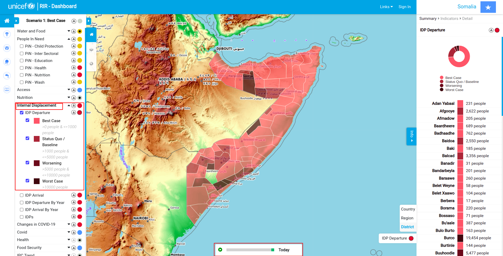

🧑‍🏫 People will leave due to conflict, drought, and other reasons. This is also interesting to compare to IDP arrivals using the slide bar to see where people are leaving and what regions they are going to who may need extra financial and technical support.

👨‍🏫 Check the box on the **IDP Arrivals layer** and use the slider to compare the two layers.

## More on the Information Panel

🧑‍🏫 While the **IDP Departures** is open, let's look at the last options and functionalities on the **Information Panel**. If the **Information Panel** is minimized or you want to minimize it. Click on the blue Info button that looks like a tab on the right-side panel to maximize and minimize it.

Inside the information panel, there is a summary of all the region/or districts and for example how many people departed that area because we are looking at the departures layer.

### Graphical Representation

🧑‍🏫 The graphical representation of the scenarios in this case a **pie chart** showing the proportion of best-case regions to worst-case and the status quo. You can hover your mouse over the chart and interact with it. For example, it will show that the best case is the reality for 54 out of the 73 districts in a pop-up label.

👨‍🏫 Hover your mouse over the pie chart and observe the labels and number of districts in different scenarios.

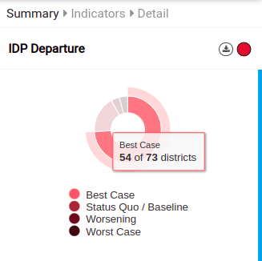

🧑‍🏫 Further click on the name Adan Yabaal and in the Indicators select **IDP departure**. This will open the details panel where you can see a line graph showing the change over time for the Adan Yabaal district as well as other pertinent information.

👨‍🏫 Click on Adan Yabaal (the text) in the **Information Panel** under the pie chart, click on **IDP Departures** (the text) and observe and hover your mouse over the line chart.

## Bringing it all together

🧑‍🏫 With your knowledge of the Geosight dashboard try an analysis where we look at what districts people are departing from and what districts they are arriving to.

* Make the context map OpenStreetMap
* Add the context layer Refugees and IDPs
* activate both the arrivals and departures indicator layers
* click on different districts and observe the detail in the information panel
* slide the slider to see if neighboring districts accept departing people, thus having higher arrivals than previously observed (see the linear graphs to compare).

Answer the following questions:

* what regions have the highest number of departures?
* What regions have the highest number of arrivals?
* what region has had the most changes in departures over time?

