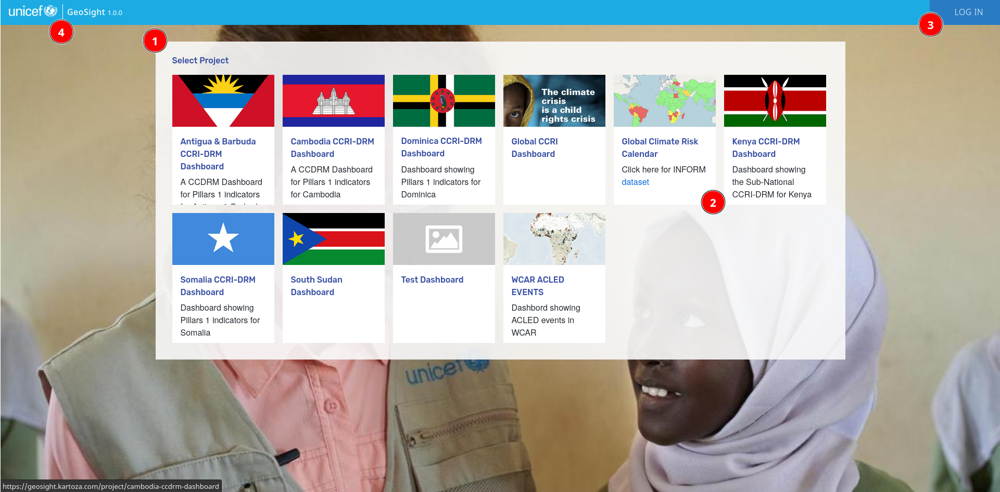

# The Home Page

The home page is your first destination when opening GeoSight. It contains a list of projects to which you have access. The project home page is organised into these areas:

## (1) The Project Gallery 

A project is a collection of indicators, context layers, widgets and filters. These components allow you to understand the operational conditions for a given areas. The projects you have access to may vary depending on whether you are logged in (see 3 below) or not.

## (2) Projects

Each project is displayed in the gallery with:

* a thumbnail representing the theme of the project
* a title for the project
* a short description of the project

If the description overflows the space provided, you can scroll vertically inside the project block to see the additional details. 

## (3) Log In

If you have an account on the platform, you can click the log in link to enter your account credentials.

## (4) Home Link

Wherever you are on the site, clicking this link will return you to this home page.
