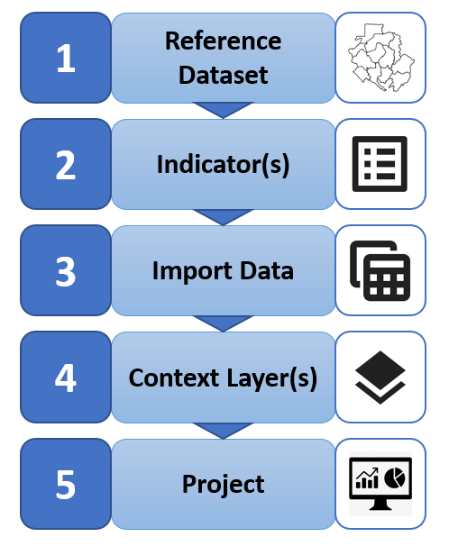
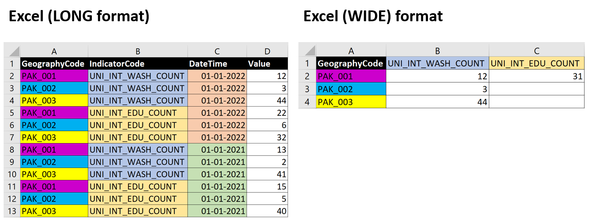

# Quickstart
This section describes the key steps for preparing a GeoSight dashboard.

1. Find existing or create a new reference boundary dataset in GeoRepo (e.g. world country boundaries or subnational boundaries for your country / region of interest)
2. Find existing or create new Indicator(s) -> e.g. Number of armed conflict events, level of malnutrition, number of children etc
3. Import data for Indicator(s) -> e.g. import one-time from Excel file, or add scheduled data harvesters (from SharePoint or API)
4. Find existing or add new Context Layer(s) -> e.g. Armed conflict events, location of schools / hospitals / UNICEF offices, areas of control etc
5. Create a new Project -> Add Indicators -> Create Indicator Layers -> Add Context Layers -> Define Filters -> Define Widgets -> Share your Project

## How to prepare data for GeoSight?
In GeoSight users can import data from multiple sources:
- APIs (JSON)
- Excel files
- SharePoint Excel
- SDMX Data Warehouse (coming soon)

The easiest way is to import data using standalone Excel file.Excel import supports two formats: 
- LONG and 
- WIDE

### Excel LONG format
- Can be used to import multiple indicators, geographies (e.g. districts) and dates in one go
- Required columns:
    - GeographyCode – contains unique code for identifying a geographic entity (e.g. district). NOTE: currently geographic entities must be from a single admin level
    - IndicatorCode – should match the Indicator’s shortcode as defined in GeoSight
    - DateTime – valid date, e.g. 01-01-2022
    - Value – observation value

### Excel WIDE format
- Can be used to import multiple indicators, geographies (e.g. districts) for a single date only
- Required columns:
    - GeographyCode – Contains unique code for identifying a geographic entity (e.g. district). NOTE: currently geographic entities must be from a single admin level
    - Indicator columns – name of each column should match the Indicator’s shortcode as defined in GeoSight
    - Value – observation value

