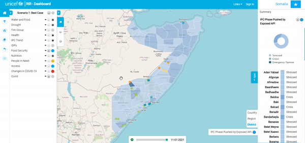

[//]: # "GeoSight is UNICEF's geospatial web-based business intelligence platform."
[//]: # 
[//]: # "Contact : geosight-no-reply@unicef.org"
[//]: # 
[//]: # ".. note:: This program is free software; you can redistribute it and/or modify"
[//]: # "    it under the terms of the GNU Affero General Public License as published by"
[//]: # "    the Free Software Foundation; either version 3 of the License, or"
[//]: # "    (at your option) any later version."
[//]: # 
[//]: # "__author__ = 'irwan@kartoza.com'"
[//]: # "__date__ = '13/06/2023'"
[//]: # "__copyright__ = ('Copyright 2023, Unicef')"
[//]: # "__copyright__ = ('Copyright 2023, Unicef')"

# Indicators

The GeoSight dashboard displays various indicators and their corresponding severity levels in the indicator panel. 
This panel can be accessed under the indicators tab which is visible when the user has selected the context analysis icon which is located above the Programme interventions bar. 
Each indicator falls under a group. The severity levels refer to how good or bad the case is for that factor within the instance. 
This ranges from worst-case scenario to best-case scenario. The case of the scenario will indicate if that region or state needs additional response or intervention. 

## Indicators
The indicators in the panel are divided into groups. Each group has a drop-down arrow and contains a subset of indicators inside. 
This allows you to activate data for each group or allows you to be more specific and select data to be displayed from an indicator within the group. 
To display activate data from a group or an indicator "check" their checkboxes which will show with a tick. Groups can be expanded or collapsed by "clicking" on the triangle next to the name of the group.
If there is a little black dot in the coloured circle next to the group or indicator, a custom dashboard will open when that circle is clicked.

## Traffic Light

To view the traffic lights, "expand" the indicators panel by "clicking" on the arrow for ‘full screen’ as indicated in the clip below. 
This will open the full indicator information page and allow you to look at the severity level for each indicator. 
To view each subsection in each group, "expand" the indicator group. The severity levels displayed are for the entire instance, in this case, they show the indicators and their corresponding severities for Somalia.

## Download Data

If you would like to download data for each group, indicator or even for the whole instance, there are various methods to do so. 
There is a download option (round icon with a download arrow in it) next to each indicator and group on the 'Indicator panel' as well as on the 'Traffic Light' screen.
The option to download data for the entire instance is in the top right corner of the screen. 
The data will download in the form of an Excel spreadsheet.

Downloading data  will provide you with country, region, district and IPC level data for the geographic location under observation.

## Info Panel

The Information panel is located on the right-hand side of the screen. It’s only visible when an indicator is selected in the indicator panel.

The panel shows the severity case of the selected indicator in each region or district (depending on what has been selected). 
It also has a graphical representation in the form of a pie chart that displays how many areas within the instance fall within each severity case. 
By "hovering" your mouse over the pie chart, you can see these values in a pop-up label. You can also download the data for that specific indicator in the info panel.

The download icon is circled in red in the image below. 

To view the severity levels of each indicator for a specific location, "click" on a region or district on the map. 
This should create a pop-up window on the screen as previously discussed in the 'Map Interactions' document. 
It should also create a tab in the 'Info Panel' called 'Indicators'.

