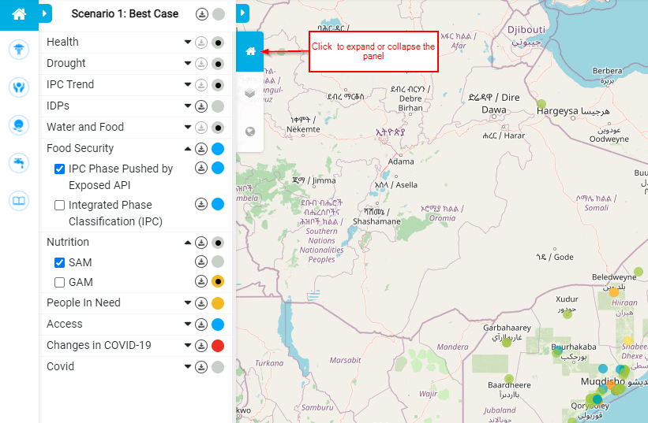
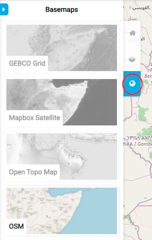
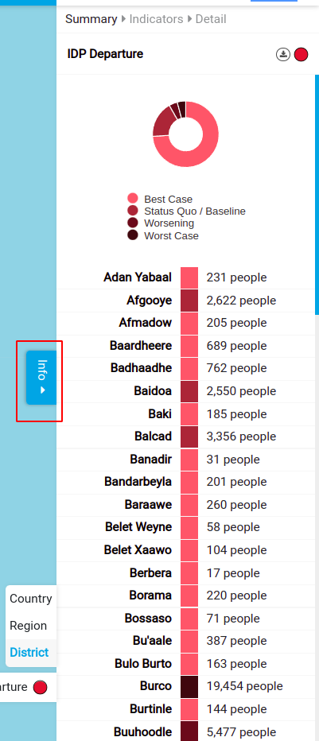

[//]: # "GeoSight is UNICEF's geospatial web-based business intelligence platform."
[//]: # 
[//]: # "Contact : geosight-no-reply@unicef.org"
[//]: # 
[//]: # ".. note:: This program is free software; you can redistribute it and/or modify"
[//]: # "    it under the terms of the GNU Affero General Public License as published by"
[//]: # "    the Free Software Foundation; either version 3 of the License, or"
[//]: # "    (at your option) any later version."
[//]: # 
[//]: # "__author__ = 'irwan@kartoza.com'"
[//]: # "__date__ = '13/06/2023'"
[//]: # "__copyright__ = ('Copyright 2023, Unicef')"
[//]: # "__copyright__ = ('Copyright 2023, Unicef')"

# Overview

The GeoSight platform is a situational awareness platform to monitor multiple factors including: health, child protection, nutrition, wash (water, sanitation and hygiene) and education in a geographic region. 

To fully understand the platform and the information you can obtain from it, you need to understand how it works.

## 1. Programme Interventions Panel

This group of buttons is used to navigate through the key areas of factors or indicators that the RIR platform accounts for. If you have admin status, more icons will be available within the panel, we will explore these additional buttons at a later stage. Each button will take you to a page as seen in the image below which will give you the intervention status of the geographic region for that specific factor. The factors in order from top to bottom are; education, child protection, nutrition, wash, and education. To return to the dashboard, "click" on the 'Context Analysis' icon which is represented as a little home symbol.

## 2. The Indicator Panel

This panel contains a list of indicators that relate to the factors accounted for by the platform. The coloured circles next to each indicator show the current severity level for that indicator within the specific geographic region. The indicators are arranged in groups that have an overall severity level for that group next to the group name. The entire collection of indicators is also given an overall status which is displayed at the top of the list. An in-depth tour of the indicators and how they work will follow.

## 3. The Indicator Icon

This button expands and collapses the indicator panel if the button is in blue as illustrated in the image below.
   
## 4. The Layers Icon

By clicking on this icon, you expand the 'Layers Panel'. This panel is where you can select or deselect the layers you want to be visible on the map canvas. The layers that you have visible should coincide with the information you are trying to obtain from the platform.

## 5. The Basemap Icon

To expand or collapse the basemap panel, "click" on this icon. When expanded, you will be able to choose which basemap you would like to be displayed on your canvas extent.

## 6. Map
The map displays a geographic area based on the instance being used. In this case, it’s Somalia. The information that is displayed on the map is determined by the layers that are selected as well the factors that have been selected within the 'Indicator Panel'. A complete guide of the map and accompanying interactions will be available in a document to follow.
 
## 7. The Info Button

The 'Info Button' expands a panel that contains a summary of the severity of the selected indicators in different locations within the geographic area. It also has an 'Indicators' option to select which illustrates the severity of all the factors for a specific location within the geographic area, this location can be selected by using your mouse and simply "clicking" on the area of interest.
  
## 8. Geography Level Panel

This panel allows you to view the area of interest at a country, region, and district geography level.

## 9. Graphical Representation

This pie chart illustrates the severities of the selected indicators for the whole geographical area or instance. This chart gives you the cumulative total of each severity out of the total number of regions or districts (depending on your settings in the geography level panel). To find out how many regions or districts fall within a specific severity level, "run" your mouse over that area of the pie chart.
 
## 10. Timelapse Bar
The 'Timelapse Bar' will show you the severity of the selected indicators over some time. As the map and the 'Info Panel' change, the corresponding date for that data will be displayed within the bar. To initiate the time-lapse, "click" on the "play" button.

## 11. Links Button
If you "click" on the "links" button, a dropdown menu appears. These are the various links to the different servers that the RIR platform connects to.

## 12. Sign in Button

To sign in to your account, "click" on this button. There is no registration option which means that in order to sign in, an account needs to be created for you by someone with the necessary permissions.